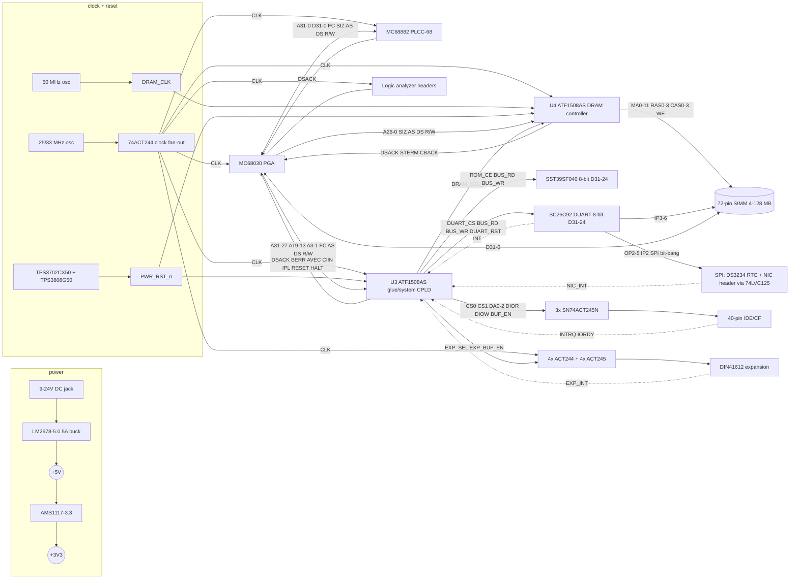

# 68030 Linux SBC: Rev A Design Specification

Status: draft for schematic entry (KiCad). Author: design agent for Matthew Bettcher. Date: 2026-09-26.

Revision note (2026-09-26, schematic start): DUART changed from SC28L92 to **SC26C92** (§8.3), and the DS1233-5 reset supervisor replaced by **TPS3702CX50 window monitor + TPS3808G50 delay/manual-reset supervisor** (§7.2). LM2678 external components now taken from the TI datasheet design procedure (§6.2).

Approved architecture: MC68030 plus MC68882, two ATF1508AS CPLDs (one for glue logic, one as the DRAM controller), and one 72-pin 5 V EDO/FPM SIMM. The SIMM is on the first revision; there is no SRAM-only bring-up board.

Conventions:
- `_n` means active low.
- **[EST]** marks an estimate or a design choice not taken from a datasheet.
- **[VERIFY]** marks something that must be checked before release.
- Page and line references point to the local copies listed in §11 (References).
- Times are ns unless stated. "WS" means wait states: extra CPU clocks beyond the minimum 3-clock asynchronous cycle.

---

## 0. Summary of key decisions

| Topic | Decision |
|---|---|
| CPU | MC68030RC33 (PGA-128, 13×13 grid), clocked at 25.000 MHz for Rev A. The clock oscillator is socketed so it can be moved to 33.333 MHz later. |
| FPU | MC68882 (PLCC-68) on the shared CPU clock. **The part must be rated ≥ the CPU clock (FN25A/FN33A).** The FN16/FN20 parts that are cheap and in stock are too slow at 25 MHz; a jumper allows an optional separate FPU oscillator (JP3). |
| Glue CPLD (U3) | ATF1508AS-7JX84. Handles address decode, the boot overlay, DSACK/wait states for 8/16-bit devices, BERR timeout, AVEC, CIIN, IPL encoding, the 100 Hz timer, reset sequencing and IDE strobes. **Fitted with fit1508 v1918 (Rev A.1, 2026-09-27), pins locked, pin keepers on: 121/128 macrocells, 57/60 user I/O used + 3 reserved (SPI), 4/4 dedicated inputs** (cpld/glue/). |
| DRAM CPLD (U4) | ATF1508AS-7JX84. A 50 MHz asynchronous FSM derived from Mackerel-30 with shorter RAS→CAS→DSACK timing, CAS-before-RAS refresh, and direct drive of the SIMM through 33 Ω series resistors. **Fitted (Rev A.1): 78/128 macrocells, 55/60 I/O (+4 jumpered reservations), register → register 14.0 ns (50 MHz met).** The 74ACT257 address-mux fallback footprints are DNP; they were not needed for the fit. |
| DRAM | One 72-pin SIMM, 60 ns (EDO or FPM), 4–128 MB. Single- and double-sided modules are supported. Side select is on A26. The row/column mapping keeps 11/11, 12/11 and 12/12 modules contiguous. |
| Memory map | DRAM at physical 0 (Mackerel-style), ROM at 0xE000_0000, I/O at 0xF000_0000, expansion window at 0xF800_0000. A boot overlay maps ROM at 0 until the first access to 0xE000_0000. |
| Boot ROM | SST39SF040 (512 KB), 8-bit, on D31–24. 1 WS at 25 MHz. Writes are gated by a CPLD flash-write-enable bit. |
| Serial | **SC26C92A1A** (PLCC-44; Intel-bus-only part), autovectored at level 5, 3.6864 MHz crystal. Driver is mainline `sccnxp` using the `sc2692` id (38.4 kbaud cap and 3-byte FIFO model until a small `sc26c92` driver entry is added, §8.3). Pin-compatible with the SC28L92 footprint (pin 12 I/M on the SC28L92 is NC on the SC26C92). **Rechecked 2026-10-03: still broker only.** XR68C681 and TL16C552A were rejected; wait states stay 2 (§3.2, §8.3). |
| Storage | 40-pin IDE/CF, 16-bit, behind 3× SN74ACT245N. PIO-0 timing from the glue CPLD (13 WS at 25 MHz, cycle ≥ 640 ns vs ATA/ATAPI-6 t0 600 ns; registered CS0/CS1/DA2:0). INTRQ goes to level 3. ACT245 meets t0/t1/t2/t4/t5/t9 at the 50 pF datasheet load (§3.2). The earlier t5 miss counted a false 19.5 ns AS→DIOR path. Wait states were not changed. |
| Ethernet | **Not on the bus in Rev A.** A SPI header (bit-banged through DUART GPIO, as on Mackerel-30) takes a W5500 or ENC28J60 module, with its interrupt on level 4. Three glue pins are reserved for a future CPLD SPI master. A fast NIC can come later as an expansion card. Rationale is in §1.4. |
| RTC | DS3234 SPI RTC with CR2032 backup, on the same SPI bus (CS1). The DS1743 parallel NVRAM RTC was rejected because of availability (DigiKey stock 0; Rochester lists it obsolete). |
| Interrupts | All autovectored. 7 = NMI button, 6 = 100 Hz timer, 5 = DUART, 4 = NIC, 3 = IDE, 2 = expansion. |
| Power | 9–24 V DC input feeding an LM2678-5.0 (5 A buck); an AMS1117-3.3 supplies 3.3 V for the NIC module. The 5 V load is estimated at about 2.4 A on board (2.9 A with SIMM peaks) plus a 1 A expansion allowance **[EST]**. |
| Reset | **TPS3702CX50** window monitor (UV 4.80 V / OV 5.20 V ±0.9%, open-drain) drives the MR input of a **TPS3808G50** (open-drain RESET, ~300 ms delay via CT). Its output `PWR_RST_n` feeds the CPLDs. The glue CPLD stretches and drives CPU RESET_n/HALT_n open-drain. A separate warm-reset button leaves DRAM refresh running. |
| Board | 4 layers: signal / GND / +5V / signal. Sockets for the CPU (PGA), FPU, CPLDs, flash and DUART (PLCC). |

---

## 1. Block diagram and KiCad hierarchical sheet plan

### 1.1 Block diagram

### 1.2 KiCad sheet plan

The root sheet (`68030-sbc.kicad_sch`) contains only hierarchical sheet symbols, the mounting holes and the fiducials. Nets that cross sheets use hierarchical labels. Wide buses use KiCad bus aliases: `ABUS` = A[0..31], `DBUS` = D[0..31], and `CTRL` = {FC[0..2], SIZ[0..1], AS_n, DS_n, R_W, …}.

| # | Sheet (file) | Contents | Main signals in / out |
|---|---|---|---|
| 1 | `power.kicad_sch` | DC jack; F1 T5A fuse; Q1 SUD50P04-08 reverse-polarity P-FET; D2 SMBJ28CA TVS; LM2678-5.0 buck with inductor, catch diode and caps; optional bench-supply 5 V input header (DNP) with jumper; AMS1117-3.3; power LED; +5V/+3V3/GND test points; bulk capacitors | out: `+5V`, `+3V3`, `GND` |
| 2 | `clock.kicad_sch` + `reset.kicad_sch` (drawn as two sheets in the KiCad project) | **clock:** X1 25 MHz can (Oscillator_DIP-14, socketed); U10 74ACT244 clock fan-out with a 33 Ω series R per output; X2 50 MHz can; optional X3 FPU oscillator (DNP) with JP3; Y1 3.6864 MHz DUART crystal + load caps (drawn here, placed at U6). **reset:** U7 TPS3702CX50 + U27 TPS3808G50 supervisor; JP401 SET jumper; SW3 cold reset (on the TPS3808 MR input); SW1 warm reset; SW2 NMI/abort; 1 kΩ `RESET_n`/`HALT_n` pull-ups | out: `CLK_CPU`, `CLK_FPU`, `CLK_GLUE`, `CLK_DRAMC`, `CLK_LA`, `CLK_EXP`, `DRAM_CLK`, `PWR_RST_n`, `WARM_RST_BTN_n`, `NMI_BTN_n`; passive: `DUART_X1/X2`; bidir: `RESET_n`, `HALT_n` (pull-ups) |
| 3 | `cpu.kicad_sch` | MC68030 PGA socket; all 10 VCC / 14 GND pins; decoupling (UM §12.x: 10 µF + 0.1 µF + 330 pF per group); pull-up networks; JP1 CDIS_n, JP2 MMUDIS_n | out: `ABUS`, `DBUS`, `FC[0..2]`, `SIZ[0..1]`, `AS_n`, `DS_n`, `R_W`, `RMC_n`, `ECS_n`, `OCS_n`, `DBEN_n`, `CBREQ_n`, `CIOUT_n`, `IPEND_n`, `STATUS_n`, `REFILL_n`, `BG_n`. in: `DSACK[0..1]_n`, `STERM_n`, `CBACK_n`, `CIIN_n`, `BERR_n`, `HALT_n`, `AVEC_n`, `IPL[0..2]_n`, `BR_n`, `BGACK_n`, `CLK_CPU`. bidir: `RESET_n` |
| 4 | `fpu.kicad_sch` | MC68882 PLCC-68 socket; A0 and SIZE tied to +5V (32-bit connection, 68881/2 UM §11.1.1); SENSE pin; decoupling | in: `ABUS` (A1–A4), `DBUS`, `AS_n`, `DS_n`, `R_W`, `FPU_CS_n`, `RESET_n`, `CLK_FPU`. out: `DSACK[0..1]_n` (three-state, direct) |
| 5 | `glue_cpld.kicad_sch` | **Drawn.** U3 ATF1508AS-7JX84 in a PLCC-84 socket (pinout from the fitter, `cpld/glue/pinout.csv`); J4 JTAG 2×5 (ATDH1150USB pinout) with R701–R703; 0.1 µF on every VCC pin + 10 µF; USER/HALTED LEDs D701/D702 (moved here from the debug sheet); EXP_INT_n 4.7k pull-up R704; JP701–703 SPI-reserve solder jumpers; TP701–706 on strobes; pins 50–52 = IDE_DA0–2 (Rev A.1; were spares with TP707–709) | see §4.2 |
| 6 | `dram.kicad_sch` (**drawn**) | U4 ATF1508AS-7JX84 in a socket (fitted pinout from `cpld/dram/pinout.csv`); J5 JTAG; J1 72-pin SIMM socket TE 5822021-4; 21× 33 Ω series R (MA, RAS, CAS, WE); SIMM decoupling and bulk; PD1–4 pull-ups; JP801–JP804 solder jumpers (STERM/CBREQ/CBACK/DS_n, open); TP801–TP809; DNP 74ACT257 fallback U801–U803 | in: `ABUS` (A0–A26), `SIZ`, `AS_n`, `DS_n`, `R_W`, `DRAM_SEL_n`, `DRAM_CLK`, `CLK_DRAMC`, `PWR_RST_n`, `CBREQ_n`. out: `DSACK[0..1]_n`, `STERM_n`, `CBACK_n`, `SIMM_PD[1..4]`, `RAS0_n`/`CAS3_n`/`WE_n` (to LA). bidir: `DBUS` |
| 7 | `rom.kicad_sch` (**drawn**) | U5 SST39SF040-70-4C-NHE in a PLCC-32 socket (DS20005022C Fig. 2, not the DIP pinout); DQ0–7 = CPU D24–31; A0–A18; CE# = ROM_CE_n, OE# = BUS_RD_n, WE# = BUS_WR_n (driven only while FLASH_WE = 1); C551 100 nF + C552 10 µF | in: `ABUS` (A0–A18), `ROM_CE_n`, `BUS_RD_n`, `BUS_WR_n`. bidir: `DBUS` (D24–31) |
| 8 | `duart_spi_rtc.kicad_sch` (**drawn**) | U6 SC26C92A1A in a PLCC-44 socket (Fig. 1 PLCC column; pin 12 NC, left open). Y1 stays on the clock sheet (`DUART_X1/X2`). J7/J8 TTL-232 headers (pin 3 cable VCC open). U22 SN74LVC125ADR (+3V3, OE low) shifts OP2/OP3/OP4/OP5. U23 DS3234S# on +3V3, BT1 to VBAT with no series diode, NC pins 2 and 7–14 to GND, both SCLK pins tied. J9 2×5. R1001 4.7 k on INTRN. R1005/R1006 1.0 k/2.2 k divider on PERIPH_RST_n. SIMM_PD1–4 into IP3–IP6 | in: `ABUS` (A0–A3), `DUART_CS_n`, `BUS_RD_n`, `BUS_WR_n`, `DUART_RST`, `PERIPH_RST_n`, `SIMM_PD[1..4]`, `SPI_HW_SCK`, `SPI_HW_MOSI`, `DUART_X1/X2`. out: `DUART_INT_n`, `NIC_INT_n`, `SPI_HW_MISO`. bidir: `DBUS` (D24–31) |
| 9 | `ide.kicad_sch` (**drawn**) | U11/U12 SN74ACT245N (DD7:0↔D31:24, DD15:8↔D23:16, DIR = R/W, OE = IDE_BUF_EN_n); U13 SN74ACT245N one-way (DIR = +5V, OE = GND) for DA2:0, CS0/1, DIOR/DIOW, RESET, with R911–R918 33 Ω [EST]; J6 40-pin (pin 20 key, 32 IOCS16 open, 34 PDIAG open, 28 CSEL to GND); R901 4.7 k IORDY, R902 10 k DD7, R903 10 k INTRQ, R904 5.6 k DMARQ, R905 10 k DMACK held high; D5 activity LED on DASP through R906 1 k | in: `IDE_DA0`–`IDE_DA2` (U3 pins 50–52), `IDE_CS0_n`, `IDE_CS1_n`, `IDE_DIOR_n`, `IDE_DIOW_n`, `IDE_BUF_EN_n`, `R_W`, `PERIPH_RST_n`. out: `IDE_INTRQ`, `IDE_IORDY`. bidir: `DBUS` (D16–31) |
| 10 | `expansion.kicad_sch` (**drawn**) | J10 HARTING 09032966821 DIN 41612 type C 3×32 female [VERIFY vs the KiCad footprint]. U14–U17 SN74ACT244DW, OE tied low (a1–a24 = A0–A23, a25–a26 SIZ, a27–a29 FC, a30 R/W, a31 AS, a32 DS). U18–U21 SN74ACT245DW (b1–b32 = D0–D31, A side = card, DIR = R/W, OE = EXP_BUF_EN_n). Row c: c1 CLK_EXP, c2 EXP_SEL_n, c3 PERIPH_RST_n, c4 BG, c5 BR, c6 BGACK, c7–c8 DSACK, c9 BERR, c10 HALT, c11 EXP_INT (open drain, pull-up is glue R704), c12–c20 GND, c21–c24 +5V, c25–c32 reserved. C1401–C1408 100 nF, C1409 10 µF | in: `ABUS`, `SIZ`, `FC`, `R_W`, `AS_n`, `DS_n`, `EXP_SEL_n`, `EXP_BUF_EN_n`, `CLK_EXP`, `PERIPH_RST_n`, `BG_n`. out: `EXP_INT_n`, `BR_n`, `BGACK_n`. bidir: `DBUS`, `DSACK[0..1]_n`, `BERR_n`, `HALT_n` |
| 11 | `debug.kicad_sch` (**drawn**) | J11–J13 Samtec TSW-120-07-G-D 2×20 headers. Pins 5/10/15/20/25/30/35/40 are GND; the other 32 pins are signals. LA1 is A31 down to A0, LA2 is D31 down to D0, LA3 is the §8.4 list in that order from pin 1. USER/HALTED LEDs stay D701/D702 on the glue sheet; LED_n and HALT_LED_n are TP1101/TP1102 only. SW1/SW2 stay on the reset sheet | in: everything listed in §8.4 |

Placement notes (from the Mackerel and KISS-68030 lessons):
- Put the CPU, FPU, both CPLDs and the SIMM in a tight cluster.
- The DRAM CPLD should sit next to the SIMM socket, with MA/RAS/CAS traces < 75 mm **[EST]**.
- Put the clock buffer in the middle of the cluster and length-match `CLK_CPU` / `CLK_GLUE` / `CLK_FPU` / `CLK_DRAMC` to ±10 mm **[EST]**.
- Keep the switcher in a corner, away from the oscillators.

### 1.3 Footprints that are not in the stock KiCad libraries
- **PGA-128 (13×13)** for the 68030: reuse `mackerel.pretty/PGA169.kicad_mod` from mackerel-68k/hardware (MIT). **[VERIFY]** the pin numbering against UM Fig. 14-1 before routing.
- **72-pin SIMM socket: TE Connectivity 5822021-4** (vertical, 72 positions, 1.27 mm pitch, tin), with a new footprint `m68030-sbc.pretty/SIMM-72_TE-5822021-4.kicad_mod` generated by `kicad/tools/mkfp_simm.py` from the TE customer drawing (`datasheets/TE_5822021_CD.pdf`):
  - pads Ø1.65 mm with 1.02 mm drill (Mackerel `SIMM-72`: 0.762 mm drill, too small, which is the hole-size bug in their build log);
  - locating holes: NPTH 1.63 mm at pin-1 end and centre (Mackerel 2.45 mm) and NPTH 2.41 mm at the far end;
  - pin/hole positions from the drawing's dimension table (A 95.25, B 115.57, C 44.45, D 55.88, E 101.19, F 107.95 mm).
  - The Mackerel footprint is not used. **[VERIFY]** whether the TE drawing's holes are plated (TE 114-1061 application spec) and print 1:1 before ordering.
- Symbols: `mackerel-68k-symbols.kicad_sym` includes MC68030, MC68882, SIMM72, DS1233 (no longer used), SST39SF040, EPM7128SLC and DIN41612_03x32_ABC.
  - The EPM7128SLC PLCC-84 symbol has the same VCC/GND/JTAG/dedicated-input pin numbers as the ATF1508AS PLCC-84 (checked against doc0784). **[VERIFY]** every pin before reusing it for the ATF1508AS.
  - SC26C92 and DS3234 symbols are project-local (`m68030-sbc:SC26C92`, `m68030-sbc:DS3234` in `tools/mklib.py`), from the PLCC column of Fig. 1 and from Maxim 19-5339. There is no stock SC26C92 symbol.
  - There is no stock LM2678 symbol: draw it from the TI pin table (TO-263-7: 1 VSW, 2 VIN, 3 CB, 4 GND, 5 NC, 6 FB, 7 ON/OFF; tab = GND). The TPS3702 and TPS3808DBV symbols are stock (`Power_Supervisor`).

### 1.4 Ethernet decision

| Option | Pros | Cons |
|---|---|---|
| RTL8019AS on the bus | ~10 Mb/s wire speed; mainline `ne` driver family | Discontinued Realtek part; PQFP-100; ISA-style 8/16-bit timing (another IDE-like wait-state generator); needs ~20 more glue nets plus a 20 MHz crystal, magnetics and RJ45; board area; glue CPLD would exceed 60 I/O |
| ENC28J60 / W5500 on SPI | Tiny modules with magnetics and RJ45 are sold ready-made; mainline `enc28j60` and `w5100-spi` drivers; Mackerel-30 runs Linux networking over a bit-banged W5500 (its config.c registers the SPI device; system_controller.v latches the W5500 IRQ at level 4); costs 4–5 DUART GPIOs and one IRQ pin | Throughput is limited by the bit-bang SPI (very roughly tens of kB/s **[EST]**, not measured) |
| Expansion card | Keeps Rev A simple; a later card can carry a faster NIC | No networking without a card |

**Decision:** Rev A has the SPI header (J9) for a W5500 or ENC28J60 module, with `NIC_INT_n` on IPL4.
- Three glue I/Os (`SPI_HW_SCK/MOSI/MISO`) go to solder jumpers, so a CPLD shift-register SPI master can replace the bit-bang later. This depends on macrocell headroom (§4.4).
- A faster Ethernet solution is deferred to an expansion card on J10, which exposes the buffered 32-bit data bus, A23:0 and interrupts.

### 1.5 RTC decision
- **Chosen:** DS3234S# (SPI, VCC 2.0–5.5 V, SOIC-20W, TCXO) on SPI_CS1 (DUART OP5), with a CR2032 on BT1 and no series diode (Maxim 19-5339: a diode on VBAT causes improper operation). The sheet powers it from **+3V3**, not +5V: VIH min is 0.7×VCC, so a 5 V part would not accept a 3.3 V high from U22. NC pins 2 and 7–14 are tied to GND; SCLK pins 18 and 20 are both connected. Mainline driver `rtc-ds3234` **[VERIFY]** that it is in the target kernel version.
  - DigiKey DS3234S#, 2026-09-26: $16.63 at qty 1, 464 in stock.
- **Rejected:** DS1743 (parallel, `rtc-ds1742`). DigiKey stock 0; Rochester lists it obsolete.
- NTP remains the fallback once networking works.

---

## 2. Physical memory map

### 2.1 Decode (glue CPLD; FC ≠ 111)

| Physical range | Size | Device | Port / DSACK | CIIN | Notes |
|---|---|---|---|---|---|
| `0000_0000–07FF_FFFF` | 128 MB window | SIMM DRAM (DRAM CPLD) | 32-bit, DSACK1+0 | no | Selected when A31:27 = 00000. Side 0 is at 0–64 MB (A26 = 0) and side 1 at 64–128 MB. Smaller modules alias inside each side; firmware probes and reports chunks (§5.2). |
| `0800_0000–DFFF_FFFF` | — | unmapped | BERR | — | Fast BERR (1 clock after decode). |
| `E000_0000–EFFF_FFFF` | 512 KB, aliased | SST39SF040 boot flash | 8-bit on D31–24, DSACK0 only | yes | A18:0 go to the flash. Reset vectors live at offset 0. Writes assert `BUS_WR_n` only when FLASH_WE = 1 (§2.4). |
| `F000_0000–F000_FFFF` | 64 KB slot 0 | SC26C92 DUART | 8-bit, DSACK0 | yes | Registers at +0x0..+0xF on consecutive byte addresses (A3:0 → DUART A3:0), so `reg_shift = 0`. |
| `F001_0000–F001_FFFF` | slot 1 | IDE command block (CS0) | 16-bit on D31–16, DSACK1 | yes | Taskfile register n is at +2n (A3:1 → DA2:0; U3 registers A3:1 once per cycle and drives IDE_DA2:0, so DA is stable for t1/t9). Data register at +0 is used as 16-bit. |
| `F002_0000–F002_FFFF` | slot 2 | IDE control block (CS1) | 16-bit, DSACK1 | yes | Alternate status / device control at +0xC (DA = 6). |
| `F003_0000–F003_FFFF` | slot 3 | Glue CPLD control registers (write-only) | 8-bit, DSACK0 | yes | See §2.4. |
| `F004_0000–F7FF_FFFF` | slots 4–F | reserved | BERR | — | A26:20 are not decoded, so slots alias every 1 MB. |
| `F800_0000–FFFF_FFFF` | 128 MB | Expansion (J10) | Card-driven DSACK (any width) | yes | Card sees buffered A23:0. A card that doesn't answer gets BERR from the timeout. |

**Why RAM is at physical 0 (as on Mackerel):**
- m68k Linux reads its memory chunks from bootinfo and maps the first chunk at kernel virtual base.
- RAM at 0 keeps the loader simple and matches the working mackerel-linux port. The exception vector table can also sit at 0 with VBR = 0.

**I/O mapping in Linux:**
- Drivers get I/O via `ioremap`.
- Optionally, `head.S` can put 0xE000_0000–0xFFFF_FFFF under a transparent-translation register (TT1, cache-inhibited, supervisor), as some other m68k platforms do. **[VERIFY]** the `mmu_map_tt` usage in arch/m68k/kernel/head.S for the target kernel.
- Hardware CIIN on the ROM and I/O regions protects code running with the MMU off and caches on (e.g. the monitor).

### 2.2 Boot overlay
1. On power-on or warm reset, the glue sets `OVERLAY = 1`.
2. While OVERLAY = 1, **any access in 0000_0000–07FF_FFFF is decoded as ROM**, and `DRAM_SEL_n` stays inactive.
3. The 68030 fetches SSP from address 0 and PC from address 4 (UM §8.1.1). Both come from flash offsets 0 and 4. Each read is a longword taken as 4 byte cycles through dynamic bus sizing.
4. The reset PC vector must point into the ROM's native region (e.g. `0xE000_0400`).
5. **The first access with A31:28 = 1110 clears OVERLAY.** From then on, address 0 is DRAM.
6. This replaces Mackerel's "count 8 AS edges" (`boot_signal.v`). That scheme depends on exactly how many reset-vector bus cycles occur; an address-triggered clear does not.
7. A software reboot can set OVERLAY again only through a reset (warm-reset button or PWR_RST). The CPU `RESET` instruction does **not** set OVERLAY, because a running kernel would lose RAM at 0. For Linux, `mach_reset` should jump to the ROM entry point at 0xE000_0400.

### 2.3 CPU space (FC2:0 = 111), decoded by glue

| A19:16 | Cycle type (UM §4.2 / §10.1.4.2) | Board response |
|---|---|---|
| 0000 | Breakpoint acknowledge | BERR (fast) → illegal-instruction exception, which is the correct behaviour with no external breakpoint hardware |
| 0010 | Coprocessor access. **A15:13 = CpID**; A4:1 select the CIR; A31:20 and A12:5 are zero | CpID = **001** gives `FPU_CS_n` = FC=111 · A19:16=0010 · A15:13=001 · AS, fitted as **one product term** (Rev A.1, no stale-decode runt; §3.2). Other CpIDs (MMU CpID 000 is internal, 010–111 unused) get fast BERR. **If no FPU is fitted, the CIR access times out to BERR; the CPU treats that as "coprocessor not present" and takes the F-line exception, and Linux FPU emulation takes over (UM §10.x).** |
| 1111 | Interrupt acknowledge (A3:1 = level) | AVEC for all levels. Level 6 IACK also clears the timer pending flag (Mackerel-style). |
| other | reserved | fast BERR |

Differences from Mackerel: its system_controller.v line 122 decodes FPU CS with FC=111 and A19:16=0010 but **not** the CpID, and it ties BERR high (line 72). Rev A decodes the CpID and implements BERR.

### 2.4 Glue control registers (write-only at 0xF003_0000; the data value is ignored; A3:1 selects the action)

| Offset | Action |
|---|---|
| +0x0 | TIMER_ENABLE |
| +0x2 | TIMER_DISABLE |
| +0x4 | TIMER_ACK (clear pending; level-6 IACK also clears it) |
| +0x6 | USER_LED on |
| +0x8 | USER_LED off |
| +0xA | OVERLAY off (backup to the automatic clear) |
| +0xC | FLASH_WE = 1 (allow flash program/erase cycles) |
| +0xE | FLASH_WE = 0 (default at reset) |

- There is no read-back: this saves glue I/O, since reading would need data-bus pins.
- Reads of this slot still terminate with DSACK0 and return undefined data.

---
## 3. Bus cycle design

### 3.1 DSACK encoding (UM Table 7-1) and port widths

| DSACK1_n | DSACK0_n | Meaning |
|---|---|---|
| H | H | insert wait states |
| H | L | complete: 8-bit port |
| L | H | complete: 16-bit port |
| L | L | complete: 32-bit port |

The CPU uses SIZ1:0 (01 = byte, 10 = word, 11 = 3-byte, 00 = long; UM Table 7-2) plus A1:0 to split operands with dynamic bus sizing. 8-bit ports sit on D31–24 and 16-bit ports on D31–16 (UM Section 7, dynamic bus sizing).

| Device | Region | Port | Who drives DSACK | Encoding | WS @25 MHz | WS @33.33 MHz | Basis |
|---|---|---|---|---|---|---|---|
| DRAM (SIMM) | 0x0xxx_xxxx | 32 | DRAM CPLD | L/L | **2–3** (fitted + post-fit sim; up to 8 on a refresh collision) | **3–4** (post-fit sim; up to 10 on a refresh collision) | §3.2, §5.6 |
| Boot flash | 0xExxx_xxxx | 8 (D31–24) | glue | H/L | **1** (2 if AS late) | **2** | §3.2 (fitted delays) |
| DUART | 0xF000_xxxx | 8 (D31–24) | glue | H/L | **2** (3 if AS late) | **3** | §3.2: with the fitted delays 1 WS would fail, 2 is required |
| CPLD registers | 0xF003_xxxx | 8 | glue | H/L | 1 | 1 | internal only |
| IDE | 0xF001/2_xxxx | 16 (D31–16) | glue | L/H | **13**, stretched by IORDY (+1 if AS late) | 18 | ATA/ATAPI-6 PIO-0 (Tables 66/67); §3.2 |
| FPU | CPU space | 32 | MC68882 directly (three-state outputs, UM §9.8) | per FPU | per FPU protocol | — | 68881/2 UM Table 9-3 |
| Expansion | 0xF8xx_xxxx | card | card (three-state, active negation) | any | card | card | — |
| IACK | CPU space | — | glue asserts AVEC (no DSACK) | — | 1 | 1 | — |
| Unmapped / bad CPU space | — | — | glue asserts BERR | — | 1 | 1 | — |

**How termination lines are driven:**
- Each CPLD drives CPU `DSACK1_n/DSACK0_n` (and the glue drives BERR_n and AVEC_n) as **three-state push-pull outputs, only while it owns the cycle**.
- When AS_n negates, the owner drives the line high and then releases it. A 1 kΩ pull-up holds it high afterwards. **Glue (Rev A.1):** driven high by AS_n↑ directly (7.5 ns) and released by the async clear ≤ 20.5 ns after AS↑ (SDF). **U4 (Rev A.1):** the same scheme: driven high by AS_n↑ directly (7.5 ns) and released by an async clear 17.5 ns after AS↑ (SDF; Rev A: ≤ 57 ns, which overlapped a following 68882 cycle, §10 risk 23).
- This mirrors what the 68882 does with its own DSACKs (UM §9.8). It meets the async hold/negate requirement: EC param #28, AS negated to DSACK/BERR/AVEC negated, max 40 ns at 25 MHz and 30 ns at 33 MHz. A resistor-only negation (1 kΩ × ~40 pF ≈ 40 ns RC) would violate #28 **[EST]**.
- Expansion cards must follow the same rule (documented in the connector spec).

### 3.2 Bus timing model and wait states (rechecked against the fitted CPLDs, 2026-09-27)

This section was first written with the ATF1508AS datasheet delays (7.5 ns per decode). The fitted glue CPLD is slower: the fitter's optimizer failed on the glue, so its decodes take 2–3 array passes. All numbers below come from the fitter SDF files, via `cpld/glue/timing.txt` and `cpld/dram/timing.txt` (ATF1508AS -7 model, board delay not included unless stated). **Rev A.1 (2026-09-27):** the glue was changed and refitted (`-pin_keep on`, same pins plus IDE_DA0–2 on 50–52). The per-cycle state is now async-cleared by AS_n, the FPU/expansion selects are single product terms, the IDE selects are registered, and the IDE wait states went from 11 to 13. The table below gives Rev A → Rev A.1 numbers. The ROM and DUART wait-state parameters did not change.

**Time reference:** t = 0 is the falling edge that starts S1. Falling edges F_n = n·T; rising edges R_n = (n−½)·T (25 MHz: R1 = 20, F1 = 40, R2 = 60, …).

**CPU timing (EC tables):**

| Param | Meaning | 25 MHz | 33 MHz |
|---|---|---|---|
| #6 | clock high to address valid (from S0 rising, t = −T/2) | max 20 ns (so address/FC valid by t ≤ 0) | max 14 ns |
| #9 | clock low to AS asserted | 3–18 ns | 2–10 ns |
| #47A | async input setup | 2 ns | 2 ns |
| #47B | async input hold | 8 ns | 6 ns |
| #27 | data-in setup | 2 ns | 1 ns |
| #31 | DSACK asserted to data valid | max 28 ns | max 20 ns |
| #23 | clock high to data-out valid | 20 ns | 14 ns |

A zero-wait asynchronous cycle recognises DSACK at F1 (end of S2) and latches read data at F2 (UM Section 7). With W wait states, DSACK is recognised at F_(W+1) and data is latched at F_(W+2).

**Fitted glue CPLD (U3) delays, ns (`cpld/glue/timing.txt` plus a per-register query of the same SDF):**

| Path | Rev A fit | **Rev A.1 fit** | Datasheet assumption used originally |
|---|---|---|---|
| FC2:0 / A31:27 → ROM_CE_n, DUART_CS_n, CIIN_n, DRAM_SEL_n | 18.5 (FC) / 13.0 | **13.0** | 7.5 |
| A / FC → FPU_CS_n, EXP_SEL_n, EXP_BUF_EN_n | 18.5 | **7.5** (single product term incl. AS_n) | 7.5 |
| AS_n → any combinational chip select | 7.5 | 7.5 | 7.5 |
| IDE_CS0/1_n, IDE_BUF_EN_n | 18.5 / 26.0 (combinational) | **registered**, CLK → pad 10.0 | 7.5 |
| CLK → IDE_DA0–2 (new, registered) | — | 4.5 | — |
| CLK → BUS_RD_n, BUS_WR_n, IDE_DIOR/W_n (registered; AS-gated) | 10.0 | 10.0 | 4.5 |
| CLK → DSACK1/0_n, BERR_n, AVEC_n | 11.0 | 11.0 | 4.5 |
| AS_n↑ → DSACK/BERR/AVEC driven high / released | 1 clock + 11 | **7.5 / ≤ 20.5** (async clear) | — |
| AS_n setup to the cycle-start register (`act`) | 6.0 | 6.0 | 6 |
| Worst input setup (FC/A31:28 → a termination flag that is first loaded at R2) | 32.0 (26.5 from AS_n) | 22.5 (17.0 from AS_n) | 6 |
| Register → register | 19.5 | **20.3** (fmax 49.3 MHz; 25 and 33.33 MHz met) | — |

**How the glue sees AS.** It samples AS_n directly on CPU_CLK rising edges; there is no synchroniser flop in front of it. The cycle starts at the first rising edge where `act` sees AS low. With a 6 ns setup, that is R1 when AS arrives by t ≤ 14 ns (25 MHz) and R2 otherwise. At 25 MHz #9 allows AS as late as 18 ns, so a late capture is possible. This is the **−4 ns AS capture margin** (20 − 18 − 6). A late capture only adds one wait state; the counter can never finish early. Near-simultaneous AS/edge timing can make the start registers metastable; they resolve within the 40 ns clock (register → register is 20.3 ns).

**Cycle-end clear (Rev A.1 fix).** Rev A cleared the per-cycle registers (`act`, counter, termination flags, strobe flags) only when a rising edge *sampled* AS_n high. At 25 MHz AS↑ can come at F + 18 (#12 max) and the next AS↓ 30 ns later (#15 min), so the only rising edge in that gap can miss AS high. The flags then carry into the next cycle: early/wrong DSACK, stray BUS_RD/DIOR. The Rev A netlist under the timed testbench gave 3008 false early terminations in ~4400 cycles. In Rev A.1 all per-cycle registers are **asynchronously cleared by AS_n high** (`cyc_clr = AS_n | ~PWR_RST_n`), which is independent of clock phase. Timed post-fit simulation shows 0 errors (nominal and 50 % derated, 5 seeds). At 33 MHz, R1 = 15 ns and AS ≤ 10 ns, so R1 capture is normal.

The registers with long input setup (≤ 22.5 ns, the termination flags) are first loaded at R2 or later, so their paths have settled. `rd_q`/`wr_q` are now qualified with `act`, so **BUS_RD/WR always start at R2 + 10 = 70 ns** (the old "slipped" case; R3 + 10 if AS is captured late, when the wait count also slips by one). The strobe is late, never early.

**Chip-select valid time:** max(13.0 from FC/A, a + 7.5 from AS) + 1 board = **≤ 26.5 ns** (a ≤ 18); FPU_CS_n/EXP_SEL_n ≤ a + 7.5 + 1. DRAM_SEL_n at U4: ≤ max(14, a + 8.5) ns.

**Decode glitch hazard — resolved in Rev A.1.** In Rev A the address/FC → select paths (13–18.5 ns) were slower than the earliest AS path (3 + 7.5 = 10.5 ns). Address/FC is valid ≥ 7 ns before AS↓ (EC #11), so a select could assert for the *previous* cycle's address for up to ~4 ns (FPU_CS_n, 18.5 − 7 − 7.5) or ~11.5 ns (IDE_BUF_EN_n).
- **FPU_CS_n was a real problem.** The 68882 starts an access on START = CS·AS·(R/W + DS) (MC68881/2 UM §12.6 note 8). A runt CS during AS with R/W high is therefore a false read start, and the chip may then drive DSACK/data. §10.2 Fig. 10-5 of the same manual shows "decode AND AS" (b) as incorrect for exactly this reason. The Rev A timed netlist gave 10 FPU_CS runts → 7 false STARTs per ~4400 cycles. **Fix:** FPU_CS_n = FC2·FC1·FC0·/A19·/A18·A17·/A16·/A15·/A14·A13·/AS in **one product term** (7.5 ns from any input, so the address, valid 7 ns before AS, always wins). EXP_SEL_n/EXP_BUF_EN_n were changed the same way. These are built from `keep` cells so synthesis cannot split them.
- **68882 timing with the fix** (UM §12.6, 25 MHz column; timed sim): #8 (CS negated before AS of a following non-FPCP cycle, ≥ 0): 0 violations. #9 (AS negated → CS negated, ≥ 5): 7.5 ns (5.1 ns at 50 % derate; relies on the ATF's unspecified minimum delay **[VERIFY]**). #8B (CS asserted → DS asserted on writes, ≥ 20): 19.57 ns nominal in the sim, i.e. write DS at AS + 27 (EC #9B min) minus 7.5 ns decode. EC note 14 says qualifying the 68881/2 CS with AS "allowing 7 ns for a gate delay" still meets #8B; the ATF's 7.5 ns is 0.5 ns over that, plus ~1 ns board **[VERIFY: ~1.5 ns short on paper at 25 MHz]**. Rechecked 2026-09-27 (U4 Rev A.1 work): #8B and #9 cannot be closed on paper with an AS-qualified CS in the -7 ATF (fastest grade, no specified minimum delay); the options and why they fail are in §10 risks 27/28.
- **ROM/DUART/DRAM/CIIN:** the decode (13.0) now settles before the AS path can open (7 + 7.5 = 14.5; 1.5 ns margin), so there is no stale window in the SDF model. They were harmless anyway: the strobes BUS_RD/WR start ≥ 70 ns. The SC26C92 ORs CEN with RDN/WRN internally, and "the signal asserted last initiates the cycle" (SC26C92 AC note 5), so a CEN runt without RDN/WRN is not an access and cannot clear status or pop the FIFO. The flash likewise needs OE#/WE#.
- **IDE:** CS0/1_n, DA2:0 and IDE_BUF_EN_n are now registered (loaded at R2, cleared one clock after AS↑), so they cannot glitch. The timed sim monitors DUART, flash and IDE for strobes outside their own cycle: 0 events.
- DRAM: U4 samples DRAM_SEL_n only at its synchronised AS edge (≥ a + 46 ns, §5.3).

**DSACK from the glue:** a register asserts at R_k and the pin changes at R_k + 11. That gives T/2 − 11 = **9 ns** setup before F_k at 25 MHz (was 15.5) and 4 ns at 33 MHz (≥ #47A 2 ns, thin). Hold after F_(k−1) is 31 ns / 26 ns (≥ #47B).

**Wait-state table (25 MHz; 33 MHz in brackets):**

| Device | Glue parameter | WS at 25 MHz (fitted) | Limiting path, worst case | Margin | Note |
|---|---|---|---|---|---|
| DRAM (SIMM, 32-bit, U4 DSACK) | — (U4 FSM) | **2** typical, **3** when the synchroniser phase is late, **up to 8** on a refresh collision [33 MHz: **3** typical, **4** late phase, **up to 10** on a refresh collision; post-fit sim, was 3–4 [EST]] | DSACK at the pin ≈ E + 92 ns, where E is the first 50 MHz edge ≥ a + 6 | data valid 13.5 ns after DSACK (#31 max 28; 20 at 33 MHz: post-fit sim margin 3.3 ns, 1.3 ns derated) | U4 Rev A.1 post-fit sim, 25 MHz: 2 WS 488×, 3 WS 154×, 4–5 WS 3×, ≥6 WS 18×, max 8; 33 MHz: 3 WS 559×, 4 WS 72×, ≥6 WS 19×, max 10 (§5.6). Unchanged by Rev A.1 (Rev A same bench: 2 WS 490×, 3 WS 144×) |
| Boot flash (SST39SF040-70, 8-bit) | ROM_WS = 1 [2] | **1** (2 if AS captured at R2) | CE ≤ max(13.0, a + 7.5) + 1 = 26.5, so data ≤ **96.5**; needed by F3 − 2 = 118 | 21.5 ns | OE path: BUS_RD at R2 + 10 = 70 (Rev A.1: always R2) + tOE 35 + 1 = 106 ≤ 118 ✓ (12 ns). DSACK at R2 + 11 = 71 vs F2 − 2 = 78: 7 ns |
| DUART (SC26C92, 8-bit) | DUART_WS = 2 [3], DUART_DLY = 0 [1] | **2** (3 if AS late) | RDN at R2 + 10 = 70 + tDD 55 + 1 = 126; needed by F4 − 2 = 158 | 32 ns | 1 WS would **fail** (126 > 118), so 2 WS is required, not just margin. CS ≤ 26.5 before RDN ≥ 30 (tCS ≥ 0 ✓); address valid ≤ 0, RDN ≥ 30 (tAS 10 ✓) |
| CPLD registers | REG_WS = 1 | 1 | internal | — | — |
| IDE (ATA PIO-0, 16-bit data / 8-bit taskfile) | **IDE_SETUP = 4 [5], IDE_PULSE = 9 [13]** (Rev A.1; was 3/8 [4/11]) | **13** + IORDY stretch (+1 if AS late) [18] | CS0/1, DA2:0 registered at R2 (+10 / +4.5 ns, + U13 skew); DIOR/W at R5 + 10 → **t1 = 120 ns** (≥ 70). DIOR ends at AS↑; DIOW ends at the DSACK1 edge. CS/DA clear one clock after AS↑ → **t9 ≥ 43.6 ns** (≥ 20, derated sim) | DIOR/W pulse **360 ns** (≥ t2 290 for 8-bit, 165 for 16-bit); t4 (DIOW↑ → data hold) ≥ 57 ns (≥ 30) | Cycle = 16 clocks = **640 ns**. Back-to-back DIOR-to-DIOR = (W + 3)·T = **640 ns ≥ t0 600** (33 MHz: 21 × 30 = 630). A late AS capture only lengthens it. Rev A: 560 ns < 600 (and t9/t1 violated by the combinational CS/address, see below). Cost: **−12.5 %** IDE throughput (≈ 3.1 vs 3.6 MB/s at 2 bytes/cycle) |
| FPU, expansion, IACK, BERR | unchanged | unchanged | — | — | see §3.1 |

**Why U4 uses the glue's DRAM_SEL_n rather than decoding DRAM itself.** Local decode would need A31–A27, FC2–FC0 and the overlay state: about 9 more U4 inputs. U4 has only 5 free pins, and 4 of them are the jumpered STERM/CBREQ/CBACK/DS_n reservations. It would also gain nothing. U4 cannot start before its AS synchroniser has seen AS (≥ a + 46 ns less metastability allowance). DRAM_SEL_n is settled at U4 by max(14, a + 8.5) ns, and U4's worst input setup is 11.5 ns, so there is **≥ 23 ns of margin**. The synchroniser, not the decode, sets the DRAM latency.

**Strobe rules kept from the original design:**
- `BUS_RD_n`/`BUS_WR_n` are registered and assert ≥ 30 ns into the cycle. That meets the SC26C92 tAS = 10 ns address setup, which a combinational strobe could violate. They are gated combinationally by AS, so they release with AS.
- **SC26C92, 5 V (SC26C92 datasheet, Philips 2000-01, AC table: tAS ≥ 10, tAH ≥ 25, tCS ≥ 0, tRW ≥ 70, tDD ≤ 55, tDF ≤ 25, tDS ≥ 25, tDH ≥ 0, tRWD ≥ 30).**
  - tRW with W = 2: RDN from 30–70 ns until AS negation near 200 ns, so ≥ 110 ns ✓.
  - tAH 25: the CPU holds the address after AS negation (#13/#15). BUS_RD/WR negate with AS **[VERIFY on the scope]**.
  - Write data valid ≤ R1 + #23 = 40 ns, long before WRN rises: tDS ✓.
  - tRWD 30: back-to-back strobes are separated by ≥ 1 clock + 10 ns. At 33 MHz the HDL adds DUART_DLY = 1.
  - VIH 2.5 V, so 3.3 V logic into IP2 is valid.
- **Chip recheck, 2026-10-03. DUART_WS stays 2, DUART_DLY stays 0. No glue refit.**
  - XR68C681 (Mackerel-30's part) is not a substitute. MaxLinear lists every orderable variant OBS, PDN dated 2024-01-23; the bus is Motorola (R/W, DTACK), not the Intel `BUS_RD_n`/`BUS_WR_n` strobes this glue already drives. Rx FIFO is 3 bytes, Tx is 1. `sccnxp`'s `sc68681` entry has no MR0, so the same 38400 cap applies.
  - TL16C552A is the 5 V, PLCC, two-channel part that is actually stocked (Digi-Key 296-1788-5-ND was active on that check) but it does not meet this cycle. SLLS189D (notes 4 and 7: not production tested): `tw4`/`tw5` IOR/IOW pulse ≥ 80 ns is met, `ten` ≤ 60 ns meets the read (data by ~131 ns vs need-by 158 ns). `td2`/`td4` recovery ≥ 80 ns does not. Shortest back-to-back gap, release on the product term (tPD1 ≤ 7.5 ns) and the next strobe at the earliest legal R2: AS high for #15 min 30 ns, R1 at AS↓+6 ns setup, R2 one clock later, pin +10 ns, minus the 7.5 ns release = 78.5 ns. `DUART_DLY=1` does not insert that gap (on the second clock `cnt_n` is already past the delay). Address hold `th1` ≥ 20 ns is the same open class as SC26C92 `tAH` ≥ 25 vs EC #13 = 7 ns.
- **Flash part on the rom sheet (2026-10-03):** SST39SF040-70-4C-NHE, PLCC-32, DS20005022C Table 11 (70 ns column) TRC/TCE/TAA = 70 ns, TOE = 35 ns. That is the grade the 1-WS budget above uses, and it still holds (CE path 21.5 ns, OE path 12 ns). No buffer on this bus. 33 MHz still needs ROM_WS = 2. WE# is BUS_WR_n, which the glue drives only while FLASH_WE = 1 (§2.4). Byte program finishes internally within 20 µs.
- **Flash at 33 MHz:** CE ≤ max(13.0, 10 + 7.5) + 1 + 70 = 88.5 vs F2 + T − 1 = 89 for W = 1: 0.5 ns, too thin to use. **W = 2 (ROM_WS = 2 when CPU_CLK_HZ > 30 MHz)** gives 119 ✓.
- **IDE: ATA/ATAPI-6 (T13/1410D rev 3a, 2001-12-14), §10.2, Table 66 (register transfer) and Table 67 (PIO data transfer), mode 0:** t0 cycle ≥ 600; t1 address valid → DIOR/DIOW setup ≥ 70; t2 DIOR/DIOW pulse ≥ 290 (8-bit register) / ≥ 165 (16-bit data); t2i recovery "–" (no separate minimum in mode 0; Table note 1: the host lengthens t2/t2i so that t0 is met); t3 write data setup ≥ 60; t4 write data hold ≥ 30; t5 read data setup ≥ 50; t6 read data hold ≥ 5; t6Z read tri-state ≤ 30; t9 DIOR/DIOW↑ → address/CS hold ≥ 20; tA IORDY setup 35; tB IORDY pulse width ≤ 1250; tRD ≥ 0; tC ≤ 5 (all ns). ATA-3 (X3T13/2008D) §9.4 Tables 21/22 give the same mode-0 numbers, and so does the Linux libata `ata_timing` table (PIO0: setup 70, act8b 290, rec8b 240, cyc 600).
  - Rev A (11 WS) failed t0 for back-to-back accesses (560 ns). The timed sim also showed t1 and t9 failures, because A3:1 went straight to the drive and the CS decode was combinational (min t1 0, t9 0). Rev A.1 meets every item above **at the U3 pins** (timed sim, derated: t0 ≥ 639, t1 ≥ 119.7, t2 360, t4 ≥ 57, t9 ≥ 43.6 ns).
  - **74HCT245 budget (ide sheet, 2026-10-03). Wait states were not changed.** SN74HCT245, TI SCLS020H: at VCC = 4.5 V, CL = 50 pF, SN74 over temperature, tpd max **28 ns** (25 °C max 22 ns). At CL = 150 pF the max is **38 ns**. No minimum is specified, so the skew used here is tpd_max − 0. The 33 Ω series resistors on U13 (R911–R918) are damping only **[EST]** and are not in this budget. Subtracting that skew from the derated U3-pin numbers:

    | Check | 50 pF / 28 ns | 150 pF / 38 ns |
    |---|---|---|
    | t0 ≥ 600 | 611 (11 ns) | 601 (1 ns) |
    | t1 ≥ 70 | 91.7 | 81.7 |
    | t2 ≥ 290 (8-bit) | 332 | 322 |
    | t4 ≥ 30 | **29** | **19** |
    | t9 ≥ 20 | **15.6** | **5.6** |

    t0/t1/t2 still meet. t4 and t9 fail over temperature (at 25 °C, 50 pF, max 22 ns they would be 35 and 21.6). Read t5 is separate and also fails: the CPU latches on the falling edge, AS rises 0–18 ns later (EC #12), and DIOR at U3 is +7.5–19.5 ns, so the unbuffered margin is about 50 − (18 + 19.5) − 2 ≈ **10.5 ns**. A 28 ns data-buffer delay is larger than that. **More wait states do not fix t4 or t5**: DIOW/DIOR release and the latch stay on the same edge. Ending DIOR one clock early would break t6 (hold ≥ 5, t6Z ≤ 30).
  - **SN74ACT245N budget (ide sheet, 2026-10-03). U11–U13 were swapped to this part. Wait states were not changed.** TI SCAS452H, orderable SN74ACT245N (PDIP-20, status Active). Switching characteristics, SN74 column, over the recommended free-air range, VCC = 5 V ± 0.5 V, load of Figure 6-1: **tPLH 1.5–8 ns, tPHL 1–9 ns**. Figure 6-1 draws **CL = 50 pF** (S1 open for tPLH/tPHL). There is **no 150 pF column** **[VERIFY]** if the cable is heavier than 50 pF. VIH = 2.0 V (§5.3), so an IDE TTL output is a legal input. The earlier “8 ns skew, t5 margin ~2.5 ns” estimate treated the two buffer delays as a difference. For t5 they add. R911–R918 (33 Ω) are still damping only **[EST]** and are not in this arithmetic. Starting from the same derated U3-pin numbers (t0 ≥ 639, t1 ≥ 119.7, t2 = 360, t4 ≥ 57, t9 ≥ 43.6):

    | Check | Limit | At the drive | Margin | How |
    |---|---|---|---|---|
    | t0 | ≥ 600 | 639 − (9 − 1) = **631** | 31 ns | both edges are tPHL, so only max−min |
    | t1 | ≥ 70 | 119.7 + 1 − 9 = **111.7** | 41.7 ns | address min (tPHL min) minus DIOR-fall max |
    | t2 | ≥ 290 (8-bit) | 360 + 1.5 − 9 = **352.5** | 62.5 ns | rise min minus fall max; 16-bit limit is 165 |
    | t4 | ≥ 30 | 57 + 1 − 8 = **50** | 20 ns | data min minus DIOW-rise max (tPLH) |
    | t9 | ≥ 20 | 43.6 + 1 − 8 = **36.6** | 16.6 ns | address/CS min minus strobe-rise max |
    | t5 | ≥ 50 at the drive, host must still meet EC #27 | **5.5 ns** before the latch | **3.5 ns** vs #27 (2 ns) | see below |
    | t6 | ≥ 5, device | not reduced by the host buffer | — | device holds data after DIOR↑; the CPU has already latched |
    | IORDY | tA 35, tB ≤ 1250 | unchanged | — | IORDY is not through the 245; one glue flop, pulse already ≥ 360 ns |

    Read t5, rechecked 2026-10-03 against the fitted equation rather than the slowest STA arc. The latch is the falling edge. AS rises 0–18 ns later (EC #12). `glue.fit` gives `!IDE_DIOR_n = (!AS_n & id00356.Q)` on MC101, one product term, fast slew, `MC_power` off (no tRPA). AS_n rising forces the pin high while `id00356.Q` is still 1, so the async clear of that flop cannot delay the edge. The SDF arcs on that cone sum to 7.5 ns (INV 1.5 + AND 3.0 + BUF 1.0 + TRI 2.0), which is the ATF1508AS-7 tPD1 maximum (doc0784 AC table, input to non-registered output, no minimum published; tOD load 35 pF). `timing.txt`'s AS_n→IDE_DIOR_n **max 19.5 ns** is the longer path through that async clear. It is not the release. DIOR at U3 is therefore at most 18 + 7.5 = **25.5 ns** after the latch, not 37.5. Data is only guaranteed 50 ns before DIOR rises **at the drive**. 50 − 25.5 − 2 ns board = **22.5 ns** before the latch with no buffer. DIOR rising is tPLH (max 8 ns): a later edge at the drive moves the device’s t5 window later. The data buffer then adds its own tpd, worst max(tPLH, tPHL) = 9 ns. Both come off the 22.5 ns: 22.5 − 8 − 9 = **5.5 ns** before the latch. EC #27 at 25 MHz is data-in setup **2 ns**, so the margin is **3.5 ns**. The old 8.5 ns miss was the 12 ns false path (19.5 − 7.5) subtracted from this same budget. No glue, wait-state, or buffer change. **13 wait states still would not have fixed a real miss:** the sample edge and the DIOR release stay on the same AS edge. Ending DIOR one clock early would still break t6 (hold ≥ 5, t6Z ≤ 30). No 150 pF ACT number exists **[VERIFY]**; this margin is only the published 50 pF (ACT) / 35 pF (tPD1) load.
    t6 is unchanged because DIOR still rises with AS, not a clock earlier. Device hold is ≥ 5 ns after DIOR at the connector (ATA-6 Table 66/67). Earliest data end at the CPU, using the same 7.5 ns SDF number as the path delay (not a datasheet minimum) plus ACT mins (tPLH 1.5, data tPHL 1): T_AS + 7.5 + 1.5 + 5 + 1 = T_AS + 15 ns. That covers EC #29 (data valid until AS) and #30 (8 ns after the latch) with 7 ns to spare when AS is earliest. doc0784 gives no tPD1 minimum for the -7 grade. If that minimum were 0, the AS-at-0 corner would be 0.5 ns short of #30 (7.5 vs 8). Same open class as risk 28 **[VERIFY]**, and not made worse by dropping the false path. t0/t1/t2/t4/t9 do not use the 19.5 ns arc; they stay at the numbers above.
  - IORDY is synchronised by one flop (`iordy_s`) and only gates the end of the pulse (earliest ≥ 360 ns after DIOR↓, ≫ tA 35). The drive puts read data up before IORDY rises (tRD ≥ 0), so DSACK1 after IORDY is safe.
  - Host terminations are on the ide sheet, ATA-6 §4.2.1 Table 5: R901 4.7 kΩ IORDY pull-up (the table value; note 10 allows 1 kΩ, not used), R902 10 kΩ DD7 pull-down (note 3), R903 10 kΩ INTRQ pull-down (note 5; active high, §3.5), R904 5.6 kΩ DMARQ pull-down, pin 28 CSEL grounded (note 4), pin 34 PDIAG not connected (note 7), DASP not driven by the host (note 9; D5 + R906 1 k only). R905 10 kΩ holds DMACK high **[VERIFY on a real drive]**; PIO only, the host does not drive it.
  - Mackerel-30 uses a similar 14-wait-clock IDE cycle at 24 MHz (system_controller.v lines 124–130). Counter: 7 bits.

### 3.3 BERR generation
1. **Fast BERR:** asserted combinationally for unmapped memory, reserved I/O slots, breakpoint-ack cycles, and coprocessor cycles with CpID ≠ 001.
2. **Timeout BERR:** a 7-bit counter runs on CPU_CLK while AS_n is low and resets when AS_n is high. At **128 clocks** (5.12 µs at 25 MHz, 3.84 µs at 33 MHz) it asserts BERR_n until AS negates.
   - This covers an absent FPU, an absent expansion card, and a stuck IORDY.
   - It is longer than the worst legitimate cycle: IDE 640 ns plus IORDY stretch (tB ≤ 1250 ns, ATA/ATAPI-6 Table 67), i.e. < 1.9 µs, and a DRAM refresh collision (< 0.5 µs).
3. **HALT_n** is not used for retry. It is asserted only together with RESET at power-on.
   - The 68030 HALT pin is **input-only** (UM Table 5-2). A halted processor is signalled by STATUS_n stuck low (UM §8.x). The glue decodes that, using the UM Fig. 12-24/12-25 PAL logic as the model, and lights the HALTED LED.

### 3.4 STERM, CBREQ, CBACK (routed for future burst)
- **`STERM_n`, `CBACK_n`:** routed to DRAM CPLD pins, 1 kΩ pull-ups, **held negated (tri-stated) in Rev A**.
- **`CBREQ_n`:** CPU output to a DRAM CPLD input.
- **Future synchronous/burst mode:**
  - STERM is a synchronous input (#60 setup 2 ns), so it cannot be driven from the asynchronous 50 MHz domain. Burst requires the DRAM FSM to run from `CPU_CLK` (CLK_DRAMC is already wired to U4 GCLK2, pin 2).
  - The column mapping puts A3:A2 on MA1:MA0, so a burst line fill only needs the CPLD to step MA1:0 through EDO page-mode cycles (tPC = 25 ns, EDO -6).
  - A burst rate around 5-2-2-2 at 25 MHz is plausible **[EST]**. It must also meet the UM Section 7 burst-cycle timing.
- U4 pins 16/17/18/50 are wired to STERM_n/CBREQ_n/CBACK_n/DS_n through open solder jumpers JP801–JP804 for this work; pin 81 (TP809) is spare (§4.3).

### 3.5 Interrupts
- **All sources are autovectored:** the glue asserts AVEC_n on every IACK cycle, FC=111 and A19:16=1111. Linux sees `IRQ_AUTO_1..7` (vectors 25–31).
- Vectored mode is not available: the SC26C92 is an Intel-bus-only part with no IACKN/68xxx mode (the SC28L92's 68xxx mode was rejected anyway because it uses IP6 as IACKN, which we need for PD4). Intel mode plus AVEC is simpler, and `sccnxp` doesn't need vectors.
- IPL2:0_n are active-low binary: level n is driven as ~n (level 7 = 000).
- The glue registers IPL on CPU_CLK rising edges so the lines never glitch. The CPU wants IPL stable for two consecutive samples (UM §8.1.x). Level 7 is edge-sensitive and non-maskable in the CPU.

| Level | Source | Type | Clear mechanism | Linux |
|---|---|---|---|---|
| 7 | SW2 NMI/abort button | debounced in glue (sampled at the 100 Hz tick), edge → held for one IACK | level-7 IACK | debug/monitor entry |
| 6 | 100 Hz CPLD timer | pending flag set by divider | level-6 IACK (as in Mackerel system_controller.v lines 168–214) or TIMER_ACK write | `legacy_timer_tick` on IRQ_AUTO_6 (as in mackerel config.c) |
| 5 | SC26C92 INTRN (open-drain, 4.7 kΩ pull-up) | level | device register reads | `sccnxp` with `IRQ_AUTO_5` |
| 4 | NIC module INT (via J9, 10 kΩ to +3V3; ATF1508 VIH min 2.0 V so 3.3 V is a legal high, doc0784) | level; the glue can also latch it on the falling edge as Mackerel does for the W5500 | device | `w5100-spi` / `enc28j60` |
| 3 | IDE INTRQ (active high; 10 kΩ pull-down) | level | status read | `pata_platform` |
| 2 | Expansion EXP_INT_n (open-drain, 4.7 kΩ pull-up) | level | card | card driver |
| 1 | — | — | — | spare |

DUART is placed above IDE because the SC26C92's 8-byte RX FIFO fills in about 0.7 ms at 115200 baud (8 × 10 bits / 115200) **[EST]**, while IDE can wait.

### 3.6 100 Hz timer
- Divider = CPU_CLK_HZ / 100:
  - 25,000,000 / 100 = 250,000 → an 18-bit counter.
  - 33,333,333 / 100 = 333,333 → 19 bits (a 0.0001% error).
- The divider width comes from a parameter, as in Mackerel system_controller.v line 170.
- The counter's low 10 bits are shared as the ≥ 520-clock reset stretch counter (§7.2) to save macrocells.

---
## 4. CPLD pin budgets (ATF1508AS-7JX84, PLCC-84)

### 4.1 Package facts (verified in Atmel/Microchip doc0784, ATF1508AS(L) datasheet Rev. 0784P, PLCC-84 pinout table)

**PLCC-84 pin allocation (84 pins total):**

| Pins | Function |
|---|---|
| 1 | INPUT/GCLR |
| 2 | INPUT/OE2/GCLK2 |
| 83 | INPUT/GCLK1 |
| 84 | INPUT/OE1 |
| 3, 43 | VCCINT |
| 13, 26, 38, 53, 66, 78 | VCCIO |
| 7, 19, 32, 42, 47, 59, 72, 82 | GND |
| 14 TDI, 23 TMS, 62 TCK, 71 TDO | JTAG |
| All remaining pins | I/O. Special cases: 81 = I/O/GCLK3, 12 = I/O/PD1, 45 = I/O/PD2 |

- **64 I/O pins plus 4 dedicated inputs.**
- JTAG ISP is a programmable option. Enabled, the 4 JTAG pins are reserved, which leaves **60 user I/O + 4 dedicated inputs**.
- Disabling JTAG frees 4 more pins but then needs a third-party parallel programmer. **We keep JTAG enabled**, because in-system reprogramming through J4/J5 is essential for Rev A.
- 128 macrocells, 5 product terms each (expandable), fMAX 166.7 MHz (-7), 5 V or 3.3 V I/O.
- Options used: pin-keeper, open-collector outputs and slew-rate control.
- Power-up reset requires a monotonic VCC rise.
- The pin-controlled power-down option (PD1/PD2) and the GCLK3 function are **not enabled**, so pins 12, 45 and 81 are ordinary I/O.
- Budget below: **JTAG enabled, 60 I/O + 4 inputs per chip.**

### 4.2 U3 glue/system CPLD: **57 of 60 I/O used + 3 reserved (SPI), 0 spare; 4 of 4 dedicated inputs used. FITTED (Rev A.1).**

**Fitted pinout (2026-09-26; Rev A.1 refit 2026-09-27 kept every pin and added IDE_DA0–2 on the former spares 50–52).** The logic in `cpld/glue/glue.v` was synthesized with Yosys 0.52 (hoglet67/atf15xx_yosys scripts) and fitted with Microchip **fit1508.exe v1918** (from ProChip 5.0.1, run under Wine 10) for ATF1508AS PLCC84, speed -7, **JTAG ON**, with every pin locked to the grouping below (`-preassign keep`, `-optimize off`, TDI/TMS internal pull-ups on, **`-pin_keep on`** since Rev A.1).
- Result (Rev A.1): `$Device PLCC84 fits`, `Pin-Keeper = ON`. **121/128 macrocells, 62 flip-flops, 322 product terms, 13 cascades, 0 foldbacks, no LAB above 100 %.** (Rev A: 111 MC, 53 FF, 263 PT.)
- The table is generated from the fitter's pin report (`cpld/glue/pinout.md` / `pinout.csv`); the KiCad glue sheet reads `pinout.csv` directly.
- The fitter's PLCC84 model gives the same VCC/GND/JTAG/dedicated-input pin numbers as doc0784 (§4.1).
- Functional simulation passes on both the RTL and the fitted gate netlist, and a timed (SDF back-annotated) post-fit simulation with a worst-case 68030 bus model passes with 0 errors (`cpld/glue/sim/`). See `cpld/glue/README.md` for the flow, fitter quirks and indicative timing.
- `tools/pinmap.py`, which produced the earlier provisional table, is superseded for U3.

| Pin | Pin function (doc0784) | Signal (net) | Dir |
|---|---|---|---|
| 1 | GCLR (dedicated input) | PWR_RST_n | in |
| 2 | OE2/GCLK2 (dedicated input) | DS_n | in |
| 4 | I/O | FC2 | in |
| 5 | I/O | FC1 | in |
| 6 | I/O | FC0 | in |
| 8 | I/O | R_W | in |
| 9 | I/O | DSACK0_n | out, 3-state (driven only while terminating) |
| 10 | I/O | DSACK1_n | out, 3-state |
| 11 | I/O | BERR_n | out, 3-state |
| 12 | I/O/PD1 | A31 | in |
| 15 | I/O | A30 | in |
| 16 | I/O | A29 | in |
| 17 | I/O | A28 | in |
| 18 | I/O | A27 | in |
| 20 | I/O | A19 | in |
| 21 | I/O | A18 | in |
| 22 | I/O | A17 | in |
| 24 | I/O | A16 | in |
| 25 | I/O | A15 | in |
| 27 | I/O | A14 | in |
| 28 | I/O | A13 | in |
| 29 | I/O | A3 | in |
| 30 | I/O | A2 | in |
| 31 | I/O | A1 | in |
| 33 | I/O | DUART_INT_n | in |
| 34 | I/O | NIC_INT_n | in |
| 35 | I/O | EXP_INT_n | in |
| 36 | I/O | NMI_BTN_n | in |
| 37 | I/O | PERIPH_RST_n | out |
| 39 | I/O | DUART_RST | out |
| 40 | I/O | LED_n | out |
| 41 | I/O | WARM_RST_BTN_n | in |
| 44 | I/O | STATUS_n | in |
| 45 | I/O/PD2 | HALT_LED_n | out |
| 46 | I/O | reserved SPI_HW_SCK (jumper | - |
| 48 | I/O | reserved SPI_HW_MOSI (jumper | - |
| 49 | I/O | reserved SPI_HW_MISO (jumper | - |
| 50 | I/O | IDE_DA0 | out (registered; Rev A.1, was spare) |
| 51 | I/O | IDE_DA1 | out (registered; Rev A.1) |
| 52 | I/O | IDE_DA2 | out (registered; Rev A.1) |
| 54 | I/O | HALT_n | out, open-drain emulated (OE) |
| 55 | I/O | DRAM_SEL_n | out |
| 56 | I/O | FPU_CS_n | out |
| 57 | I/O | ROM_CE_n | out |
| 58 | I/O | BUS_RD_n | out |
| 60 | I/O | BUS_WR_n | out |
| 61 | I/O | DUART_CS_n | out |
| 63 | I/O | IDE_CS0_n | out |
| 64 | I/O | IDE_CS1_n | out |
| 65 | I/O | IDE_DIOR_n | out |
| 67 | I/O | IDE_DIOW_n | out |
| 68 | I/O | IDE_BUF_EN_n | out |
| 69 | I/O | EXP_SEL_n | out |
| 70 | I/O | EXP_BUF_EN_n | out |
| 73 | I/O | IDE_INTRQ | in |
| 74 | I/O | IDE_IORDY | in |
| 75 | I/O | AVEC_n | out, 3-state |
| 76 | I/O | CIIN_n | out, push-pull |
| 77 | I/O | IPL0_n | out |
| 79 | I/O | IPL1_n | out |
| 80 | I/O | IPL2_n | out |
| 81 | I/O/GCLK3 | RESET_n | bidir, open-drain emulated (OE) + read back |
| 83 | GCLK1 (dedicated input) | CLK_GLUE | in |
| 84 | OE1 (dedicated input) | AS_n | in |

Notes:
- **A12–A4 are not needed** in the glue: CPU-space decode uses A19:13, IACK uses A3:1, register decode uses A3:1, and IDE_DA2:0 are registered copies of A3:1. The UM says A12:5 are zero in coprocessor cycles.
- **SIZ and A0 are not needed** in the glue: the DRAM CPLD handles byte lanes.
- `DS_n` on the OE2/GCLK2 pin and `AS_n` on OE1 are used as ordinary logic inputs. Dedicated inputs can feed the array.
- `RESET_n` is bidirectional open-drain. The glue drives it at power-on or warm reset, and reads it to detect the CPU `RESET` instruction, which generates `PERIPH_RST_n` / `DUART_RST`. Open-drain is emulated with the pin's output enable (driven low only when asserted); the fitter's `open_collector` option is not used.
- `CIIN_n` is **push-pull** (the glue is its only driver). `DSACKx_n`, `AVEC_n` and `BERR_n` are three-state: each is driven only while its own termination flag is set, actively negated from AS_n rising (7.5 ns) and released by the async clear ≤ 20.5 ns after AS↑ to the 1k pull-ups.
- Pins 46/48/49 (SPI master reserve) go through open solder jumpers JP701–JP703. Pins 50–52 (spares in Rev A, with TP707–709) now carry IDE_DA0–2 to U13 on the ide sheet; TP707–709 were deleted. With `-pin_keep on` the unused/reserved pins have keepers.
- `DUART_RST` is active high because the SC26C92 RESET pin (38) is active high (SC26C92 datasheet pin table; the SC28L92 in Intel mode is the same).
- IDE `DIR` is `R_W` directly on the SN74ACT245Ns, so it needs no CPLD pin. The same applies to the expansion 74ACT245s.
- SIMM presence detect (PD1–4) goes to DUART inputs IP3–IP6, not to a CPLD.

### 4.3 U4 DRAM controller CPLD: **FITTED** (fit1508 v1918, 2026-09-27): 55 of 60 I/O used by the logic, 4 reserved behind open solder jumpers, 1 spare; 3 of 4 dedicated inputs used by the logic (pin 2 wired but unused)

The authoritative pin list is `cpld/dram/pinout.csv` (extracted from `dram.fit`); the KiCad `dram` sheet reads it.

| Pin | Pin function | Side | Signal | Dir |
|---|---|---|---|---|
| 1 | INPUT/GCLR | top | PWR_RST_n (GCLR) | in |
| 2 | INPUT/OE2/GCLK2 | top | CLK_DRAMC (CPU-clock copy, for a future synchronous FSM; **unused** in the Rev A logic) | in |
| 83 | INPUT/GCLK1 | top | DRAM_CLK 50 MHz (GCLK1) | in |
| 84 | INPUT/OE1 | top | AS_n (OE1 used as input) | in |
| 4 | I/O | top | MA10 | out |
| 5 | I/O | top | MA11 | out |
| 6 | I/O | top | RAS0_n | out |
| 8 | I/O | top | RAS1_n | out |
| 9 | I/O | top | RAS2_n | out |
| 10 | I/O | top | RAS3_n | out |
| 11 | I/O | top | CAS0_n | out |
| 12 | I/O/PD1 | left | DSACK0_n | tri-state out |
| 15 | I/O | left | DSACK1_n | tri-state out |
| 16 | I/O | left | STERM_n via JP801 (open) | reserved; unused pin held by the pin keeper |
| 17 | I/O | left | CBREQ_n via JP802 (open) | reserved |
| 18 | I/O | left | CBACK_n via JP803 (open) | reserved |
| 20 | I/O | left | MA0 | out |
| 21 | I/O | left | MA1 | out |
| 22 | I/O | left | MA2 | out |
| 24 | I/O | left | MA3 | out |
| 25 | I/O | left | MA4 | out |
| 27 | I/O | left | MA5 | out |
| 28 | I/O | left | MA6 | out |
| 29 | I/O | left | MA7 | out |
| 30 | I/O | left | MA8 | out |
| 31 | I/O | left | MA9 | out |
| 33 | I/O | bottom | A10 | in |
| 34 | I/O | bottom | A9 | in |
| 35 | I/O | bottom | A8 | in |
| 36 | I/O | bottom | A7 | in |
| 37 | I/O | bottom | A6 | in |
| 39 | I/O | bottom | A5 | in |
| 40 | I/O | bottom | A4 | in |
| 41 | I/O | bottom | A3 | in |
| 44 | I/O | bottom | A2 | in |
| 45 | I/O/PD2 | bottom | A1 | in |
| 46 | I/O | bottom | A0 | in |
| 48 | I/O | bottom | SIZ1 | in |
| 49 | I/O | bottom | SIZ0 | in |
| 50 | I/O | bottom | DS_n via JP804 (open) | reserved (write CAS does not wait for DS) |
| 51 | I/O | bottom | R_W | in |
| 52 | I/O | bottom | DRAM_SEL_n | in |
| 54 | I/O | right | A26 | in |
| 55 | I/O | right | A25 | in |
| 56 | I/O | right | A24 | in |
| 57 | I/O | right | A23 | in |
| 58 | I/O | right | A22 | in |
| 60 | I/O | right | A21 | in |
| 61 | I/O | right | A20 | in |
| 63 | I/O | right | A19 | in |
| 64 | I/O | right | A18 | in |
| 65 | I/O | right | A17 | in |
| 67 | I/O | right | A16 | in |
| 68 | I/O | right | A15 | in |
| 69 | I/O | right | A14 | in |
| 70 | I/O | right | A13 | in |
| 73 | I/O | right | A12 | in |
| 74 | I/O | right | A11 | in |
| 75 | I/O | top | CAS1_n | out |
| 76 | I/O | top | CAS2_n | out |
| 77 | I/O | top | CAS3_n | out |
| 79 | I/O | top | WE_n | out |
| 80 | I/O | top | MUX_SEL (row/column select for the DNP 74ACT257 fallback; TP808) | out |
| 81 | I/O/GCLK3 | top | spare (TP809) | - |

Notes:
- **A26–A2 (25 lines)** carry the row/column/side mapping. **A1, A0, SIZ1, SIZ0** feed the CAS byte-lane table.
- **`DRAM_SEL_n`** comes from the glue CPLD (U3 pin 55 → U4 pin 52), because the glue has FC2:0, A31:27 and the overlay state. Timing check: §3.2 (≥ 23 ns margin).
- **STERM_n, CBACK_n, CBREQ_n, DS_n** reach U4 only through open solder jumpers JP801–JP804. The Rev A logic does not use them, and the fitter's pin keeper holds the unused pins. Close a jumper only with a matching CPLD image (future burst/DS-qualified write).
- **Drive strength:**
  - ATF1508AS IOL is 12 mA at TTL level (doc0784 DC table).
  - SIMM input capacitance, Micron MT8D432/MT16D832 datasheet: A0–A10 are 48 pF (16 MB) / **95 pF (32 MB double-sided)**; WE_n 64/**127 pF**; RAS_n 32 pF; CAS_n 16/32 pF.
  - A 12 mA driver into ~100–130 pF plus the trace gives a slow edge of roughly 10 ns **[EST]**. That is acceptable at a 20 ns FSM tick, because MA changes a full tick before CAS.
  - 33 Ω series resistors R804–R824 sit at the CPLD on MA0–11, RAS0–3, CAS0–3 and WE (justification in §5.8).
- **Fallback B, footprints only (DNP; not needed for the fit).** U801–U803 are 74ACT257 (MC74ACT257DR2G, SOIC-16) with I0 = row (A12–A21), I1 = column (A2–A11) for MA2–MA11, S = MUX_SEL (U4 pin 80) and OE = GND. The DNP 33 Ω resistors R829–R838 connect their outputs to MA2–MA11. To switch to them: remove R806–R815, fit U801–U803, R829–R838 and C818–C820, and load a CPLD image with MA2–MA11 tri-stated. The 74ACT257 pinout was checked against the ST 74ACT257 and onsemi MC74ACT257 datasheets. With the muxes fitted, U4 would not need A4–A11/A14–A21 (a new pinout would free up to 20 pins, but it needs a refit and a board change). Keep these footprints only if board space allows. They exist for signal integrity, not for the fit.
- A TQFP-100 ATF1508AS was not needed either. The suggested ATF1508AS-10AU100 is a -10 part. Per doc0784's AC table, -10 vs -7 is tPD1 10 vs 7.5 ns, tCOP 5 vs 4.5 ns and fCNT 100 vs 125 MHz. Scaling the fitted 14.0 ns register path by 10/7.5 gives ≈ 18.7 ns **[EST]**, so 50 MHz would be marginal. The ordering table also lists a green -7 TQFP-100 (ATF1508AS-7AX100).

### 4.4 Macrocell use (fitter results)

| CPLD | Macrocells | Main consumers |
|---|---|---|
| Glue | **121 of 128 (fit1508 v1918, -optimize off, Rev A.1; Rev A was 111)**; estimate was 85–105 | timer divider 18–19 + ctrl 3; BERR counter 7; wait-state counter 5 + state 3; reset stretch (shares timer low bits) + 3; AS sync 1; selects ~14 (combinational); DSACK/AVEC/BERR/CIIN with active negation ~8; IPL encoder + NMI debounce ~6; overlay, flash_we, LED, halted detector ~8 |
| DRAM | **78 of 128 (fit1508 v1918, -optimize on, -pin_keep on, Rev A.1; Rev A was 80)**, 50 flip-flops (was 52), 206 product terms (was 210), foldback 6 / cascade 9; the estimate was 50–65 | MA mux + column flop 12+; RAS 4; CAS 4; WE, MUX_SEL; DSACK 2 (one ack register per pin, async-cleared by AS_n); AS sync 3; one-hot FSM 13; refresh interval counter 9; init counter; side toggle; request latch |

- The optional CPLD SPI master (about 15–20 macrocells **[EST]**) does **not** fit in the 7 remaining glue macrocells as synthesized. Leave it for Rev B or an expansion card unless a better synthesis (e.g. a CUPL rewrite so the fitter's optimizer can be used) frees space.
- **Toolchain (used for U3, works on Linux):** Verilog → Yosys 0.52 with the hoglet67/atf15xx_yosys techmap/cells → EDIF → Microchip `fit1508.exe` v1918 (extracted from ProChip 5.0.1 with innoextract, run under Wine 10) → JEDEC. See `cpld/glue/README.md`. The alternatives, WinCUPL, or Quartus II 13.0sp1 (EPM7128SLC84) followed by POF2JED, were not needed.
- **Programming:** ATDH1150USB or a compatible JTAG cable on J4 (U3) and J5 (U4). U4's flow is in `cpld/dram/build.sh`; the optimizer is **on** for U4 (with it off, the worst register → register path was 21 ns and failed 50 MHz).

---
## 5. DRAM controller design

The baseline is Mackerel-30 `pld/mackerel-30/dram_controller/dram_controller.v` (MIT, 318 lines; local clone at /workspace/68030-ref/mackerel-68k/). Mackerel-30 is a working 68030 Linux board built with the same kind of SIMM and a 50 MHz asynchronous controller in an EPM7128S. The changes made here are listed in §5.7. The implementation, fit and simulations are in `cpld/dram/` (see its README).

### 5.1 72-pin SIMM facts (Micron MT8D432 / MT16D832 datasheet, 16 MB and 32 MB EDO/FPM; mirror at https://www.pjrc.com/tech/mp3/simm/datasheet.html)

**Power and control pins:**

| Signal | Pins |
|---|---|
| VSS | 1, 39, 72 |
| VDD | 10, 30, 59 |
| RAS0_n / RAS1_n / RAS2_n / RAS3_n | 44 / 45 / 34 / 33 |
| CAS0_n / CAS1_n / CAS2_n / CAS3_n | 40 / 43 / 41 / 42 |
| WE_n | 47 |
| PRD1–PRD4 (presence detect) | 67–70 |

**Address pins:** A0–A10 are on pins 12–19, 28, 31 and 32. A11 is pin 29, which is NC on these 11/11 modules and used on 12-row modules.

**Banks and byte lanes:**
- RAS0/RAS2 select side (bank) 0: RAS0 covers DQ1–16 and RAS2 covers DQ17–32. RAS1/RAS3 select side 1 (double-sided modules only).
- CASn is a byte lane: CAS0 = DQ1–8, CAS1 = DQ9–16, CAS2 = DQ17–24, CAS3 = DQ25–32.
- **Board wiring:** DQ1–8 → D7:0, DQ9–16 → D15:8, DQ17–24 → D23:16, DQ25–32 → D31:24. That makes CAS3 = D31:24 = the byte at address offset 0 (big-endian), the same convention Mackerel uses (CAS[3] ↔ D31:24).

**Presence detect:** PD encodings are vendor-specific. On the Micron parts, 16 MB -6 has PRD1 = VSS and the others NC; 32 MB -6 has PRD2 = VSS and the others NC; -5 EDO parts use PRD3/PRD4. The pins get 10 kΩ pull-ups and go to DUART IP3–IP6. Firmware only *reports* them; **sizing is done by probing.**

**Other datasheet constraints:**
- OE_n is tied low inside the module, so **only EARLY WRITE is allowed**: WE_n must be low before CAS_n falls (tWCS ≥ 0).
- **Power-up:** a 100 µs pause, then 8 RAS cycles (RAS-only or CBR with WE_n high).
- **Refresh:** 2,048 cycles / 32 ms for these modules; 4,096 / 64 ms for 12-row (64 MB-class) modules. Both work out to one row every 15.6 µs.
- The module's VDD is specified at 5 V ±10%.

**EDO -6 timing (ns):**

| Parameter | Value | Parameter | Value |
|---|---|---|---|
| tRAC | 60 | tASR | 0 |
| tCAC | 15 | tRAH | 10 |
| tAA | 30 | tASC | 0 |
| tRC | 104 | tCAH | 10 |
| tPC | 25 | tCP | 10 |
| tRCD min | 14 | tCSR (CBR) | 5 |
| tRP | 40 | tCHR (CBR) | 10 |
| tRAS | 60–10,000 | tCSH | 45 |
| tCAS min | 10 | tRSH | 15 |
| tOFF | 0–15 | tWHZ | 0–15 |
| tRWL / tCWL | 15 | tWCH | 10 |

- **EDO output behaviour:** the output stays on until the *later* of RAS_n and CAS_n goes high, then turns off within tOFF. On FPM parts, the first of the two to go high starts tOFF.

**Supply current, 16 MB -6:** ICC random ≤ 1,040 mA; CBR ≤ 1,040 mA; EDO page ≤ 800 mA; standby 8 mA (TTL levels).

### 5.2 Address multiplexing

The DRAM CPLD drives MA from a combinational 2:1 mux:

| MA | Row (RAS phase) | Column (CAS phase) |
|---|---|---|
| MA0–MA9 | A12–A21 | A2–A11 |
| MA10 | A22 | A23 |
| MA11 | A24 | A25 |

- Side select is **A26**: side 0 (RAS0 + RAS2) when A26 = 0, side 1 (RAS1 + RAS3) when A26 = 1. This is the same as Mackerel (dram_controller.v lines 169–172).
- Mackerel uses row = ADDR[13:2] (line 159) and column = ADDR[25:14] (line 184). That puts the low address bits in the **row**, so sequential accesses change rows and EDO/FPM page mode and burst are impossible.
- This board uses the conventional arrangement: the column holds the low bits. Sequential longwords then stay in one page, which enables future page-mode/burst operation (§3.4). The cost is some extra MA mux logic, which fits.

| Module (common organisations) | Geometry per side (row/col bits) | Per side | Address bits used | Result |
|---|---|---|---|---|
| 4 MB (1M×32) | 10/10 | 4 MB | A21:2 | contiguous (aliased ×16 within the side) |
| 8 MB (2M×32, 2×1M double-sided) | 11/10, or 10/10 ×2 | 8 MB, or 4 MB ×2 | A22:2 | contiguous per side |
| 16 MB (4M×32) | **11/11** (e.g. MT8D432, "2K refresh") | 16 MB | A23:2 | contiguous |
| 16 MB (4M×32, 4K-refresh parts) | **12/10** | 16 MB | A24, A22:2 (A23 unused) | two 8 MB pieces at 0 and 16 MB. Firmware must detect this and report 2 chunks. |
| 32 MB (2×16 MB double-sided, MT16D832) | 11/11 per side | 16 MB ×2 | side 0 at 0, side 1 at 64 MB | 2 chunks |
| 32 MB single-sided (8M×32) | 12/11 | 32 MB | A24:2 | contiguous |
| 64 MB single-sided (16M×32) | 12/12 | 64 MB | A25:2 | contiguous |
| 64 MB double-sided (2×8M×32) | 12/11 per side | 32 MB ×2 | 0 and 64 MB | 2 chunks |
| **128 MB double-sided (2×16M×32)** | **12/12 per side** | 64 MB ×2 | A26:2 | **contiguous 0–128 MB** |

- The typical organisations above are **[EST]**; check the real module against its datasheet.
- m68k Linux accepts several memory chunks from bootinfo: `BI_MEMCHUNK` entries, up to NUM_MEMINFO. **[VERIFY]** NUM_MEMINFO and that `CONFIG_SINGLE_MEMORY_CHUNK` is off.
- **Firmware memory probe:**
  1. For each side, write a unique pattern at each power-of-two offset.
  2. Detect aliasing to find the size and any A23 hole.
  3. Report the chunks.
- **Optional improvement (Rev B):** use spare/jumpered U4 pins as `BANKSEL[1:0]` jumpers that move side select to A24, A25 or A26. Double-sided 16 MB/side and 32 MB/side modules would then also be contiguous. This conflicts with the burst reservation, so choose one.

### 5.3 Clock choice and clock-domain crossing (as implemented in `cpld/dram/dram.v`)
- **DRAM_CLK = 50.000 MHz** (20 ns tick) from a separate oscillator on U4 GCLK1 (pin 83). This is the same as Mackerel, whose REFRESH_CYCLE_CNT at line 28 assumes 50 MHz.
  - The fitted worst register → register path is **14.0 ns, so 50 MHz is met with 6.0 ns margin** (fmax ≈ 71 MHz; `cpld/dram/timing.txt`). A lower controller clock is not needed.
  - DRAM_CLK is independent of the CPU clock, so the CPU can move from 25 to 33 MHz without touching the DRAM timing.
- **Crossing:** only **AS_n** is synchronised: three flops (as1 → as2 → as3), where as1/as2 are the 2-flop synchroniser (Mackerel lines 70–85) and as3 detects the edge.
  - **Rev A.1:** as1 is asynchronously **set** by AS_n high and is cleared only after as2 has seen it (`as1 <= as1 & ~as2`), so an AS-high gap of any length reaches the FSM. The FSM ends a cycle on as3. Rev A sampled AS_n directly (6 ns setup, 20 ns clock); the shortest AS-high gap (EC #15: 30 ns at 25 MHz, 23 ns at 33 MHz) leaves a capture window of only gap − 6 ns − hold, so it could be missed, leaving U4 in sAck: DSACK asserted in the next (foreign) cycle. Seen in the Rev A whole-system derated sim (§10 risk 29).
  - A cycle starts **only on the synchronised AS falling edge** (`as_new = ~as2 & as3`), never on the AS level. A level test can start a cycle on the *previous* cycle's AS after a short AS-high gap (bug found in the post-fit simulation and fixed).
  - **DRAM_SEL_n is not synchronised.** It is sampled at the `as_new` clock, ≥ a + 46 ns after AS_n falls at the pin (less a metastability allowance). By then the glue decode, including its glitch, has settled for ≥ 23 ns (§3.2). A request that arrives during a refresh is latched (`dreq`) and served afterwards.
  - R_W, SIZ1:0, A1:0 and the address are stable while AS is asserted (UM Section 7), so they are sampled directly (fitted setup 6.0 ns; A26 11.5 ns).
- **Output side:** RAS, CAS, WE, MUX_SEL and the column select are pin/buried registers that hold the **active-low pin value** and are **asynchronously preset by AS_n negation** (macrocell product-term preset). `PWR_RST_n` feeds the same preset.
  - Refresh RAS/CAS ignore AS: the preset term is `AS_n & ~refm`.
  - Fitted release delays: AS_n↑ → RAS/CAS 14.0 ns; → WE/MUX_SEL 11.0 ns; → MA back to row 16.5 ns; → DSACK driven high 7.5 ns (combinational) and released to Z 17.5 ns (Rev A.1).
  - These meet EC #28 (40 ns at 25 MHz, 30 ns at 33 MHz), which Mackerel's synchronised negation (lines 225–249) would not meet at 33 MHz. They also turn off EDO data sooner.
  - Because the release is a preset rather than a combinational gate, a quickly re-asserted AS for the next (possibly foreign) cycle cannot re-open the strobes.
  - DSACK1/0 (Rev A.1): `DSACKx_n = kx ? ~(kx & AS) : Z`, one ack register kx per pin (fit1508 fails on a shared enable), set with CAS and **asynchronously cleared by AS_n high** (`AS_n | ~PWR_RST_n`). AS_n↑ drives the pin high after one array pass (7.5 ns), and the clear turns the output enable off 17.5 ns after AS_n↑ (SDF; post-fit sim 17.5, ≤ 15.9 derated). No clock is involved, so the release does not depend on the synchroniser phase. Rev A cleared the enables one clock after as1 saw AS high: released up to 57 ns after AS_n↑.
- **Optional synchronous mode:** the CPU clock copy CLK_DRAMC is wired to U4 GCLK2 (pin 2) but unused in Rev A. A later image can run the FSM on the CPU clock. That removes the synchroniser latency (about 1 WS) and makes STERM/burst possible.
- **33 MHz upgrade:** keep 50 MHz. The fitted design would also run somewhat faster (fmax ≈ 71 MHz), but tRAC 60 ns dominates, so the gain is small **[EST]**.

### 5.4 State machine (50 MHz, 20 ns ticks; one-hot sI, sRow, sCol, sAck, sR0–sR8)

Notation: `e0` is the DRAM_CLK edge at which `go_cpu` is true: synchronised AS edge (or a latched request), DRAM_SEL_n low, idle, no refresh pending, init done. In idle the MA mux selects **row**, and the address is stable before AS, so tASR ≥ 0 is met.

| Edge | State | Actions | Check (EDO -6), post-fit sim values |
|---|---|---|---|
| e0 | sI → sRow | RAS_n of the side selected by A26 ← 0 (RAS0+RAS2, or RAS1+RAS3) | tASR ✓ |
| e0+20 | sRow → sCol | column select ← 1 (MA pads switch 10 ns after the clock); MUX_SEL ← 1; WE_n ← 0 for writes | tRAH 25.5 ≥ 10; tWCS 20 (early write) |
| e0+40 | sCol → sAck | CAS3:0_n per §5.5 (reads: all four); DSACK ack registers k1/k0 set (pads low at +11 ns) | tRCD 40 ≥ 14; tASC 14.5 ≥ 0 |
| AS_n↑ (async) | sAck | preset releases RAS/CAS (14 ns), WE/MUX_SEL (11), column → row (16.5); DSACK driven high (7.5) and k1/k0 cleared → Z (17.5); as1 set | tRAS ≥ 80.1, tCAS ≥ 62.9, tWCH ≥ 59.9 (25 MHz post-fit) |
| as3 high | sAck → sI | — | next cycle needs a new synchronised AS edge; tRP ≥ 60.1 (sim) |
| refresh | sR0 → sR8 → sI | R1: CAS all ← 0 (WE high); R2: RAS(side k) ← 0; R6: RAS, CAS ← 1; R7–R8 and the idle return give precharge; side toggles at R8 | tCSR 20 ≥ 5; tRAS 80 ≥ 60; tCHR 80 ≥ 10; tRP ≥ 60 |

**Refresh (CBR):**
- The interval counter fires every **375 DRAM clocks = 7.5 µs** and alternates sides, so each side is refreshed every **15.0 µs** (Rev A.1 post-fit and system sims, all seeds: worst gap per side 15,235 ns ≤ 15,625 ns):
  - 4,096 rows × 15.0 µs = 61.4 ms ≤ 64 ms ✓
  - 2,048 × 15.0 µs = 30.7 ms ≤ 32 ms ✓
- A tick that arrives during a refresh is kept, not lost.
- Mackerel refreshes every 781 clocks = 15.62 µs (line 28), which leaves essentially no margin against 15.625 µs.
- Alternating sides halves the peak refresh current on double-sided modules (§6). On single-sided modules, the side-1 refresh drives unused RAS1/RAS3 harmlessly.

**Arbitration:** refresh starts only from idle. A CPU access that arrives during a refresh waits up to one refresh sequence. In the post-fit sim this gave a maximum of 8 WS at 25 MHz (10 at 33 MHz), far below the 128-clock BERR timeout.

**Init sequence:**
1. After PWR_RST_n releases, the FSM counts 14 refresh ticks (105 µs) with RAS/CAS idle high: the 100 µs pause.
2. It then issues 16 back-to-back CBR cycles, 8 per side.
3. Only then are CPU accesses acknowledged. Sim: first RAS at 105.2 µs.

Firmware must wait ≥ 250 µs after power-up before touching DRAM **[EST]**. The first ROM instructions come from flash, so this is easy. An early access gets no DSACK and BERRs via the glue timeout (tested in the sim).

Soft resets do not reset U4: the warm-reset button and the RESET instruction don't touch PWR_RST_n, so refresh continues and memory contents survive for post-mortem debugging.

### 5.5 CAS byte-lane table (identical to Mackerel lines 89–122, after UM Table 7-4)

CAS3 = D31:24 (offset 0), CAS2 = D23:16, CAS1 = D15:8, CAS0 = D7:0. A 1 in the table means CAS asserted. Reads assert all four CAS lines; the 32-bit port always returns all lanes and the CPU picks the ones it needs.

| SIZ1 SIZ0 | A1 A0 = 00 | 01 | 10 | 11 |
|---|---|---|---|---|
| 01 byte | 1000 | 0100 | 0010 | 0001 |
| 10 word | 1100 | 0110 | 0011 | 0001 |
| 11 three-byte | 1110 | 0111 | 0011 | 0001 |
| 00 long | 1111 | 0111 | 0011 | 0001 |

### 5.6 Latency and wait states (fitted timing + post-fit simulation)

Using the §3.2 time base with AS_n at U4 at time a (3–18 ns at 25 MHz):
1. E is the first DRAM_CLK edge ≥ a + 6 ns (as1 setup). as2 follows at E + 20, and e0 = E + 40.
2. RAS falls at e0 + 4.5. CAS and the DSACK registers switch at e0 + 40, and DSACK reaches the CPU pin at ≈ E + 92 ns (11 ns clock-to-pad + 1 ns board).
3. The CPU recognises DSACK at the first F_n ≥ DSACK + 2 ns.
   - a = 3: 2 WS for ≈ 85 % of clock phases, otherwise 3 WS.
   - a = 18: 2 WS for ≈ 10 %, otherwise 3 WS.
4. Read data is valid at ≈ e0 + 65.5 ns (CAS + tCAC, tRAC), 13.5 ns after DSACK: EC #31 (≤ 28) ✓.

| Result (Rev A.1, tb_dram ~650 DRAM cycles, half with worst-case AS gaps) | RTL 25 MHz | Post-fit 25 MHz | Post-fit 33.33 MHz |
|---|---|---|---|
| 2 WS | 589 | 488 | — |
| 3 WS | 57 | 154 | 559 |
| 4 WS | 1 | 1 | 72 |
| ≥ 5 WS (refresh collision) | 17 (max 7) | 20 (max 8) | 19 (max 10) |
| #31 min margin (≤ 28 / ≤ 20 ns) | 4.8 ns | 11.3 ns (9.3 derated) | **3.3 ns (1.3 derated)** |

**33.33 MHz (T = 30 ns):** now simulated (was 3–4 WS [EST]): 3 WS typical, 4 on a late synchroniser phase, up to 10 on a refresh collision. The #31 margin at 33 MHz is thin but positive in all runs; per EC note 2, #31 need not be met when #47A is met (data then only needs #27 at the next edge), and the read-data latch check passes in every run.

**Writes:** same latency. CAS for writes is not qualified by DS, because CPU write data is valid at t ≤ R1 + #23 = 40 ns (25 MHz), long before CAS at ≥ e0 + 40 ≈ 95 ns. DS_n reaches U4 pin 50 only through JP804 (open). **[VERIFY]** at bring-up against the UM write-cycle figure.

**Mackerel's FSM for comparison:** IDLE → RW1 → RW2 → RW2A → RW3 → RW4 (waits for DS) → RW4A → RW5 is about 7 ticks after e0, i.e. about 4–5 WS at 25 MHz.

### 5.7 Changes vs Mackerel-30 (summary)
1. Row/column bit order swapped (column = A2–A11, A23, A25), to make page mode and burst possible later.
2. RAS → column → CAS/DSACK takes 2 ticks after the start edge, instead of about 6.
3. The cycle starts on the synchronised AS *edge*. DRAM_SEL_n is sampled once, at that edge (not synchronised).
4. RAS, CAS, WE, column select and DSACK are released by an asynchronous preset/clear on AS negation (EC #28, faster EDO turn-off). DSACK is actively driven high (7.5 ns), then released to Z (17.5 ns) straight from AS_n (Rev A.1).
5. Refresh every 7.5 µs alternating sides, instead of 15.62 µs on all sides.
6. Explicit init: 105 µs pause + 16 CBR cycles.
7. Write CAS does not wait for DS.
8. STERM/CBREQ/CBACK/DS_n are wired to U4 through open solder jumpers.
9. Reset only on PWR_RST_n.
10. The 50 MHz register timing is verified from the fitter SDF, and the post-fit netlist is simulated against a 60 ns EDO SIMM model (`cpld/dram/sim/`).

**Read → write turnaround (EDO):** data turns off tOFF ≤ 15 ns after the later of RAS/CAS rises, i.e. ≤ 14 + 15 = 29 ns after AS negation. In the Rev A.1 sims the SIMM had released the bus ≥ 14.9 ns (post-fit, 25 MHz; ≥ 14.7 derated) / 17.9 ns (RTL) before the next driver turned on, but only **≥ 5.3 ns at 33 MHz** (≥ 6.5 derated; Rev A 5.2), because the CPU drives write data earlier (#23 max 14 ns). Not changed by Rev A.1; board delay not included **[VERIFY at 33 MHz on the scope]**. FPM modules are not affected.

### 5.8 Series resistors, decoupling and presence detect (dram sheet)
- **33 Ω series resistors R804–R824** at U4 on MA0–11, RAS0–3, CAS0–3 and WE.
  - Source termination: CMOS driver output impedance (~15–25 Ω **[EST]**) + 33 Ω ≈ the Z0 of a 50–60 Ω trace, which damps ringing into the SIMM's lumped load.
  - The cost is an extra RC edge time into the SIMM input capacitance (Micron: A 48/95 pF, WE 64/127 pF, RAS 32 pF, CAS 16/32 pF): 33 Ω × 127 pF ≈ 4.2 ns worst (WE on a 32 MB double-sided module), 33 Ω × 95 pF ≈ 3.1 ns on MA.
  - That fits inside the smallest simulated margins (tASC 14.5 ns, tRAH 25.5 ns, tWCS 20 ns post-fit, board load not included). The value is a starting point; tune it after the first scope shots (bring-up stage 6).
- **SIMM decoupling:** C810–C812 100 nF + C813–C815 10 µF at the three VDD pins, plus C816–C817 470 µF low-ESR radial at the socket ends (§6.3). U4: C801–C808 100 nF (one per VCC pin) + C809 10 µF.
- **Presence detect:** PD1–PD4 have 10 kΩ pull-ups (R825–R828) and go to DUART inputs IP3–IP6 as hierarchical labels SIMM_PD1–4, not to either CPLD. Firmware reads them through the DUART input-port register as advisory information only; PD codes are vendor-specific. **Sizing is by probing (§5.2).** This keeps them off U4, which has no pins to spare.
- **Test points:** TP801 RAS0, TP802 RAS1, TP803–TP806 CAS0–3, TP807 WE, TP808 MUX_SEL, TP809 U4 spare pin 81.

---
## 6. Power budget, regulator and decoupling

### 6.1 5 V budget

| Load | Current (mA) | Basis |
|---|---|---|
| MC68030 @25/33 MHz | ≤ 520 | EC: PD max 2.6 W at 5 V (max figure; typical is lower) |
| MC68882 | ≤ 150 | 68881/2 UM: PD max 0.75 W |
| 2× ATF1508AS-7 | ≤ 320 static, ~400 active | doc0784: ICC1 standby ≤ 160 mA each (commercial). Active figure **[EST]** |
| SIMM, average | ~600 | **[EST]**. Micron ICC4 ≤ 1,040 mA is at tRC min (104 ns); our cycle is ≥ 200 ns with idle gaps. A double-sided module adds the other side's standby current |
| SIMM, peak | 1,040+ per active side | ICC4/ICC8 max. Staggered refresh keeps it to one side at a time. Instantaneous current spikes are higher than the average ICC; the KISS-68030 wiki reports > 1 A transients **[EST]** |
| SST39SF040 | ≤ 35 | datasheet: 10 mA typical active; 35 mA max program/erase |
| SC26C92 | ≤ 10 | SC26C92 datasheet ICC max (operating, CMOS input levels) |
| DS3234 | ~1 | **[EST]** |
| Oscillators (2 fitted) | ~60 | **[EST]**, 25–30 mA each for full-can CMOS |
| Buffers: 5× 74ACT244, 4× 74ACT245, 3× SN74ACT245N, 74LVC125 | ~150 | **[EST]**, dynamic |
| IDE: CF card in True-IDE mode | ~200 | **[EST]**. A 2.5" HDD or Microdrive needs more; power it separately |
| NIC module via AMS1117-3.3 | ~200 | **[EST]**. Typical W5500/ENC28J60 module draw has not been verified |
| LEDs, pull-ups, supervisors | ~50 | **[EST]** (TPS3702/TPS3808 draw µA) |
| **On-board total** | **≈ 2.4 A typical-max, ≈ 2.9 A with SIMM peaks** | **[EST]** |
| Expansion allowance | 1,000 | design choice |
| **Design total** | **≈ 3.9 A** | |

### 6.2 Regulator
- **U8: TI LM2678S-5.0** (fixed 5 V, 5 A, TO-263-7, footprint `Package_TO_SOT_SMD:TO-263-7_TabPin4`).
  - Input 8–40 V according to the TME/Bristol listings, so **use a 9–24 V DC input** (12 V recommended).
  - DigiKey 2026-09-26: LM2678S-5.0/NOPB $9.26 at qty 1, 466 in stock.
  - The 3 A LM2596S-5.0 ($8.30 at DigiKey) was rejected because the 3.9 A design total exceeds it.
- **External components from the TI datasheet design procedure** (SNVS029L, June 2025, §7.2.1.2, `datasheets/LM2678.pdf`). Operating conditions: VOUT = 5 V (fixed), VIN max = 24 V, ILOAD max = 4 A (the 3.9 A design total):
  - **Inductor (Step 3):** the LM2678-5 nomograph (Fig. 7-3) at 24 V / 4 A falls in region **L41 = 22 µH, 5.22 A** (Table 7-3; the listed Renco/Pulse parts are legacy). Chosen modern equivalent: **Bourns SRP1770TA-220M**, 22 µH ±20 %, DCR 26.5 mΩ max, Irms 12 A, Isat 18 A (Bourns SRP1770TA datasheet) — well above the 5.22 A requirement. Footprint `Inductor_SMD:L_Bourns_SRP1770TA_16.9x16.9mm`.
  - **Output capacitor (Step 4):** Table 7-5 (fixed 5 V, 22 µH, surface mount) gives **3× KEMET T495 code C4 = 100 µF / 10 V** (Irms 1.1 A each), or 3× AVX TPS C2 (100 µF/10 V), or 2× Sprague 594D C7 (180 µF/16 V). Chosen: 3× KEMET T495X107K010ATE100 **[VERIFY exact PN/ESR]**, `Capacitor_Tantalum_SMD:CP_EIA-7343-43_Kemet-X`. The fixed-output loop is compensated for these ESR values: **do not substitute all-ceramic output capacitors.**
  - **Input capacitor (Step 5):** Table 7-7 (5 V, 22 µH, SMD) lists 3× Sprague 594D C13 (15 µF/50 V) or 4× KEMET T495 C12 (4.7 µF/50 V); the requirement behind the table is WV > VIN max and Irms > ½ ILOAD (2 A). Chosen instead: **3× 10 µF 50 V X7R 1210 ceramic** (each rated well above 1 A RMS **[VERIFY with the vendor ripple curve]**) plus **1× 100 µF 50 V aluminium electrolytic** for damping of the input cable inductance (datasheet §7.1.4 warns about ringing). Deviation from the table is deliberate: solid tantalum on a hot-plugged barrel jack risks surge failure.
  - **Catch diode (Step 6, §7.1.5):** Schottky, current rating > ILOAD max, VR ≥ 1.3 × VIN max = 31 V. Table 7-4 lists 40 V / 5 A SMD parts (MBRD1545CT, 6TQ045S). Chosen: **Diodes Inc B540C-13-F** (40 V, 5 A, VF 0.55 V @ 5 A, SMC; B520C–B560C datasheet), `Diode_SMD:D_SMC`. Average diode current at 12 V in is ILOAD × (1 − D) ≈ 3.9 × (1 − 5/12) ≈ 2.3 A **[EST]**.
  - **Boost capacitor (Step 7, §7.1.6):** **0.01 µF, 50 V ceramic** CB–VSW. (The pin-function table says "100 nF"; the design procedure and §7.1.6 both say 0.01 µF. We follow the design procedure; a 0805 pad accepts either.)
  - **ON/OFF (pin 7):** left **open** (enabled). Datasheet §6.3.6: pull high or float to enable; the pin must not exceed its 6 V absolute maximum, and pin 7 must be left open when ON/OFF control isn't needed. **It must not be tied to VIN.** SJ201 (solder jumper, open) to GND provides an optional disable. FB (pin 6) goes directly to the output capacitors (fixed version).
- Input protection (schematic sheet `power`):
  - **F1: 5×20 mm T5A (time-lag) glass fuse** in a Schurter 0031.8201 PCB holder (`Fuse:Fuseholder_Cylinder-5x20mm_Schurter_0031_8201_Horizontal_Open`). Generic, multi-source part, easy to replace.
  - **Q1: Vishay SUD50P04-08** P-channel MOSFET (40 V, 8.1 mΩ, TO-252; stock KiCad symbol `Transistor_FET:SUD50P04-08`, footprint `Package_TO_SOT_SMD:TO-252-2`). Drain to the fuse (jack side), source to VIN. At power-up the body diode conducts, then Vgs = −VIN turns the channel on; a reversed input leaves Q1 off. Stock 2026-09-26: Newark 1851 pcs (-BE3, $2.61), TME 1622 pcs (-GE3).
  - Gate: **R201 10 kΩ** to GND and **D3 MMSZ5242B (12 V zener, SOD-123)** from gate to source, which clamps |Vgs| to 12 V (Q1 Vgs max ±20 V, and a 24 V input would exceed it) **[VERIFY D3 stock]**.
  - **D2: SMBJ28CA** bidirectional TVS on VIN (28 V standoff, above the 24 V maximum input). Its clamp voltage at rated peak pulse current (~45 V) is right at the LM2678 45 V absolute maximum **[EST]**, so it guards against short spikes; F1 clears sustained faults.
- Optional **J3 bench-supply 5 V input** (DNP), with a jumper that isolates the buck. This is useful for current-limited first power-up from a bench supply.
- **U9: AMS1117-3.3** (SOT-223, `Package_TO_SOT_SMD:SOT-223-3_TabPin2`) for J9/U22.
  - Dissipation is about (5 − 3.3) × 0.2 = 0.34 W **[EST]**.
  - 10 µF input (C209) and **22 µF solid tantalum output (C210)**. Verified: the AMS1117 datasheet (Advanced Monolithic Systems, 'Stability' section) says 22 µF solid tantalum on the output ensures stability for all operating conditions.

### 6.3 Decoupling and bulk

**68030 (UM §12: "10 µF, 0.1 µF and 330 pF capacitors in parallel"; 10 VCC and 14 GND pins, Table 12-7):**
- VCC pins: C6, D10, L6, K10, K4, D4, H3, F2, F11, H11.
- GND pins: C5, C7, C9, E11, J11, L9, L7, L5, J3, E3, L8, G3, F3, G11.
- Fit 10× 0.1 µF X7R 0805 on the bottom side under the socket (one per VCC pin), 4× 330 pF C0G, 2× 10 µF X7R, and 1× 220 µF low-ESR electrolytic within 20 mm **[EST quantities]**.

**68882:** 0.1 µF per VCC pin **[VERIFY count from the PLCC-68 pinout]**, plus 10 µF.

**Each ATF1508AS:** 0.1 µF on each of the 8 VCC pins (3, 43, 13, 26, 38, 53, 66, 78), plus 10 µF.

**SIMM:**
- 0.1 µF plus 10 µF at each VDD pin (10, 30, 59).
- 2× 470 µF low-ESR electrolytic at the socket ends. KISS-68030's lesson was to raise bulk capacitance to 470 µF.
- Check: a 1 A refresh step lasting 100 ns drawn from 30 µF of local ceramic sags only ΔV = IΔt/C ≈ 3.3 mV **[EST; ignores ESL]**. The bulk capacitors cover the average current and the regulator's loop response.

**Every other IC:** 0.1 µF at the VCC pin. Oscillators get 0.1 µF plus 10 µF, with an optional ferrite bead.

**Stack-up:** L1 signals, L2 solid GND, L3 +5V plane (with a 3V3 island near J9), L4 signals. Avoid splitting GND. Stitch vias at every decoupling capacitor.

**Thermal:**
- The 68030 at 2.6 W max with θJA 30 °C/W (PGA; the EC marks this value as estimated) gives up to +78 °C rise.
- **Fit a stick-on PGA heatsink**, especially at 33 MHz **[VERIFY TJ max in the EC]**.

---

## 7. Clocking and reset

### 7.1 Clocks

**CPU clock:**
- X1 is a 25.000 MHz, 5 V CMOS full-can oscillator in a 14-pin DIP socket (`Oscillator:Oscillator_DIP-14`), so it can be swapped for 33.333 MHz later.
- It feeds U10 74ACT244; all inputs are tied to the one source to minimise skew.
- Each buffer output gets a 33 Ω series resistor **[EST; tune]** and drives a single load:

| Buffer output | Destination |
|---|---|
| `CLK_CPU` | 68030 CLK |
| `CLK_FPU` | JP3 pin 1 → 68882 CLK |
| `CLK_GLUE` | U3 pin 83 (GCLK1) |
| `CLK_DRAMC` | U4 pin 2 (GCLK2, optional synchronous mode) |
| `CLK_LA` | logic-analyzer header |
| `CLK_EXP` | J10 |
| 2 outputs | spare |

- Route CPU/glue/FPU clocks with matched lengths. With the fitted glue, DSACK has 9 ns of setup slack at 25 MHz and 4 ns at 33 MHz (§3.2), so keep the skew to a couple of ns.

**CPU clock requirements (UM §7.8, EC):**
- The 68030 needs a **continuous** clock whenever powered.
- The clock must be **stable by the time VCC reaches the minimum operating level**. Oscillator start-up is well inside the TPS3808G50 reset delay (≈ 300 ms with CT tied to VDD through 100 kΩ, TPS3808 datasheet).

**FPU clock:**
- The approved design is the shared CPU clock (JP3 set to 1-2).
- The 68881/2 UM says "the main processor and the FPCP can operate at different clock speeds" (§1). **X3 (DNP)** plus JP3 2-3 therefore lets a slower or cheaper 68882 (FN16/FN20) run from its own oscillator if a 25/33 MHz part cannot be found.

**DRAM clock:** X2 is a 50.000 MHz 5 V CMOS oscillator driving U4 GCLK1 (pin 83) directly through 33 Ω. It has a single load.

**DUART clock:**
- Y1 is a 3.6864 MHz HC-49 crystal on X1/X2 (pins 36/37), with load capacitors sized to the crystal's CL (e.g. 2× 22 pF **[EST]**).
- Alternative: a 3.6864 MHz oscillator into X1.
- The SC26C92 accepts 0.1–8 MHz on X1/CLK (VIH on X1 is 0.8 VCC, so an external oscillator must be a CMOS-level part).

### 7.2 Reset
1. **Power supervisor: U7 TPS3702CX50DDCR + U27 TPS3808G50DBVT** (both TI, SOT-23-6, active and stocked at DigiKey 2026-09-26; the DBVR reel shows 0 but the DBVT small reel, same die, has 1381 pcs at $2.36):
   - **Why two parts:** the LM2678-5.0 output is 4.85–5.15 V over line, load and temperature (TI SNVS029L electrical table). A supervisor must therefore trip above the 68030's 4.75 V minimum but below 4.85 V, i.e. inside a 100 mV window. Fixed-threshold supervisors at "4.75 V nominal" have ±1.5–5 % accuracy and trip as low as 4.4–4.7 V; the DS1233-5 trips at 4.50–4.75 V.
   - **U7 TPS3702CX50** (TI SBVS251A, Feb 2024): window comparator with SENSE on +5V and SET tied to VDD (SET ≥ 0.75 V selects the ±4 % window). Released thresholds (Table 10-2): **UV 4.80 V, OV 5.20 V**, accuracy ±0.9 % over temperature → **UV trips at 4.757–4.843 V**, OV at 5.153–5.247 V (above the regulator's 5.15 V max). Hysteresis 0.3–0.8 % (typ 0.55 %), so recovery occurs at ≤ ≈ 4.88 V worst case, ≈ 4.83 V typical. UV and OV are **open-drain, active low**, wired-OR into U27 MR. No internal delay (19–35 µs propagation).
   - **U27 TPS3808G50** (TI SBVS050N): provides the reset delay and the manual-reset input. SENSE on +5V (fixed 4.65 V threshold, a redundant backstop), **MR** (internal 90 kΩ pull-up; we add 10 kΩ to +5V for the TPS3702 pull-up, inside its 2.2 kΩ–10 MΩ range) driven by the TPS3702 wired-OR and by **SW3 cold reset**. **CT tied to VDD through 100 kΩ (datasheet 40–200 kΩ option) → 300 ms typ (180–420 ms) reset timeout** after MR releases. RESET is **open-drain**, pulled up by 10 kΩ (datasheet recommends 10 kΩ–1 MΩ) to +5V.
   - U27 RESET is named **`PWR_RST_n`** and goes to U3 pin 1 and U4 pin 1 (GCLR, also used as a logic input).
   - Power-up: below 2 V the TPS3702 outputs are undefined, but the TPS3808 holds RESET low from its 0.8 V power-on-reset level until SENSE > 4.65 V and MR is high, then adds ≈ 300 ms.
2. **U3 (glue) drives `RESET_n` and `HALT_n` open-drain** (1 kΩ pull-ups):
   - while PWR_RST_n is low (combinational, since registers are cleared);
   - for **1,024 CPU clocks** after a debounced `WARM_RST_BTN_n` press. This exceeds the UM §7.8 minimum of 520 clocks; the counter shares the timer's low bits.
   - Asserting HALT with RESET follows 68000-family practice. The 68030 only requires RESET (UM §7.8).
3. **Soft resets:**
   - The CPU `RESET` instruction drives RESET_n for 512 clocks (EC #56).
   - U3 sees RESET_n low from *any* source and asserts **`PERIPH_RST_n`**, which drives IDE RESET- (through U13), expansion RESET_n and the NIC module RST (through a 2.2 k/3.3 k divider **[EST]**).
   - U3 also asserts **`DUART_RST`** (active high, as the SC26C92 requires).
   - The FPU RESET pin is tied to the CPU RESET_n net, so it resets with the CPU.
4. **U4 (DRAM) resets only on PWR_RST_n**, so refresh survives warm resets and RESET instructions (§5.4).
5. **OVERLAY** is set on PWR_RST_n or warm reset, but not by the RESET instruction (§2.2).
6. **Brown-out coverage:** the 68030 is specified at 5 V ±5 % (4.75–5.25 V). The TPS3702CX50 window (UV 4.757–4.843 V, OV 5.153–5.247 V) sits inside that range, so any supply excursion outside the CPU's rated range asserts PWR_RST_n. Residual risk: a regulator near its 4.85 V low limit leaves only ~7 mV above the worst-case UV release point (≈ 4.88 V max incl. hysteresis) — see §10 #12.

---

## 8. Pinout notes for schematic entry

### 8.1 MC68030 (PGA-128)

**Unused and optional pins:** the EC advises tying unused inputs to VCC or GND. UM §12.1.1 (the 68020-socket adapter example) pulls STERM, CBACK, CIIN and MMUDIS up and leaves STATUS, REFILL, CBREQ and CIOUT unconnected.

| Pin | Dir (UM Table 5-2) | Treatment on this board |
|---|---|---|
| CDIS_n | in | 10 kΩ pull-up + **JP1** to GND (cache disable). Also to LA3 |
| MMUDIS_n | in | 10 kΩ pull-up + **JP2** to GND. Linux needs the MMU, so leave the jumper off in normal use |
| STERM_n | in | 1 kΩ pull-up; U4 (three-state, held off in Rev A) |
| CBACK_n | in | 1 kΩ pull-up; U4 (held off) |
| CIIN_n | in | 1 kΩ pull-up; U3 |
| AVEC_n | in | 1 kΩ pull-up; U3 |
| DSACK0_n, DSACK1_n | in | 1 kΩ pull-ups (these are also the holding resistors the 68882 requires, UM §9.8); driven by U3, U4, the FPU and expansion |
| BERR_n | in | 1 kΩ pull-up; U3, expansion |
| HALT_n | **in only** on the 68030 | 1 kΩ pull-up; U3 (open-drain), expansion |
| RESET_n | bidir open-drain | 1 kΩ pull-up (CPU IOL 10.7 mA, EC); U3, FPU RESET, LA3 |
| BR_n | in | 1 kΩ pull-up (there is no other bus master in Rev A); to J10 for future DMA |
| BGACK_n | in | 1 kΩ pull-up; to J10 |
| BG_n | out | to J10 and a test point; otherwise NC |
| IPL2..0_n | in | driven push-pull by U3, **plus 10 kΩ pull-ups** so a blank or unprogrammed CPLD means "no interrupt" |
| CLK | in | CLK_CPU through 33 Ω |
| CBREQ_n | out | to U4 (future burst) and LA3 |
| CIOUT_n | out | test point only |
| STATUS_n | out | U3 (HALTED LED detector, modelled on UM Figs. 12-24/25) and LA3 |
| REFILL_n | out | LA3 |
| ECS_n, OCS_n | out | LA3 |
| DBEN_n | out | test point only. The CPU side has no data buffers; the expansion buffers use EXP_BUF_EN_n from U3 |
| IPEND_n | out | LA3 |
| RMC_n | out | LA3. Not needed with a single bus master |
| VCC / GND | — | VCC C6, D10, L6, K10, K4, D4, H3, F2, F11, H11; GND C5, C7, C9, E11, J11, L9, L7, L5, J3, E3, L8, G3, F3, G11 (UM Table 12-7) |
| NC pins | — | leave unconnected per UM Fig. 14-1 **[VERIFY against the Mackerel symbol]** |

Use bussed SIP-9 1 kΩ networks (`Resistor_THT:R_Array_SIP9`) or 0603 arrays (`Resistor_SMD:R_Array_Convex_4x0603`) for the pull-up bank.

### 8.2 MC68882 (PLCC-68)
- **32-bit connection:** tie **A0 and SIZE to VCC** (68881/2 UM §11.1.1). A1–A4 go to CPU A1–A4. D31–D0 are full width.
- CS_n ← `FPU_CS_n`. AS_n, DS_n, R/W and RESET_n are shared with the CPU. CLK comes from JP3.
- **DSACK1_n/DSACK0_n go directly to the CPU DSACK nets.** They are three-state outputs that the FPU actively drives high after the cycle and then floats (UM §9.8). No CPLD pass-through is needed; Mackerel routes them through its system CPLD.
- SENSE (UM §9.11): tie to GND. The UM Fig. 9-2 presence-detect circuit is optional and not used, because the BERR timeout plus F-line trap already handles a missing FPU.
- **Speed grade must be ≥ the CPU clock** (MC68882FN25A/FN33A), or use X3/JP3.
- Pin numbers: use the Mackerel `MC68882` symbol **[VERIFY against the 68881/2 UM PLCC pinout]**.

### 8.3 SC26C92A1A (PLCC-44), Intel bus (SC26C92 datasheet, Philips 2000-01, PLCC44 pin table)
- **Bus pins:**
  - CEN 39 ← `DUART_CS_n`; RDN 10 ← `BUS_RD_n`; WRN 9 ← `BUS_WR_n`.
  - A0 2, A1 4, A2 6, A3 7 ← CPU A0–A3.
  - D0–D7 on pins 28, 18, 27, 19, 26, 20, 25, 21 ↔ CPU D24–D31.
- **Control pins:**
  - RESET 38 ← `DUART_RST` (active high).
  - INTRN 24 → `DUART_INT_n`, with a 4.7 kΩ pull-up (open-drain output).
  - X1/CLK 36 / X2 37 to the crystal.
  - VCC 44, VSS 22. NC: 1, 12, 23, 34.
- **Other IP/OP pins:** IP0 8, IP1 5, IP2 40, IP3 3, IP4 43, IP5 42, IP6 41; OP0 32, OP1 14, OP2 31, OP3 15, OP4 30, OP5 16, OP6 29, OP7 17; TxDA 33, RxDA 35, TxDB 13, RxDB 11. Input-port pins have internal pull-ups.
- **GPIO allocation:**
  - IP0 CTSA, IP1 CTSB, IP2 SPI_MISO, IP3–IP6 SIMM PD1–PD4 (10 kΩ pull-ups).
  - OP0 RTSA, OP1 RTSB, OP2 SPI_SCK, OP3 SPI_MOSI, OP4 SPI_CS0_n (NIC), OP5 SPI_CS1_n (RTC), OP6/OP7 spare (LED/jumper).
- **Compatibility with the SC28L92 footprint (checked pin by pin against both datasheets):** every bus, data, control, crystal, IP/OP, TxD/RxD and supply pin is on the same PLCC44 pin. The only difference is **pin 12: I/M (bus-mode select) on the SC28L92, NC on the SC26C92**. Pin 12 is left open (open = Intel mode on the SC28L92), so either part can be fitted. Functional differences: 8-byte FIFOs (SC28L92: 16), Intel bus only, slower bus timing (§3.2), ICC ≤ 10 mA, VIH 2.5 V.
- **Linux driver:** mainline `sccnxp` has no `sc26c92` id (ids: sc2681, sc2691, sc2692, sc2891, sc2892, sc28202, sc68681, sc68692). Use **`sc2692`** (register-compatible subset; freq 1–4 MHz, 3.6864 MHz is fine). Limitations: the driver models a 3-byte FIFO and does not use MR0, so baud rates above 38,400 are refused. A small driver patch adding an `sc26c92` entry (FIFO 8, MR0 extended baud to 230.4k) is recommended **[VERIFY MR0 bit layout vs the SC28L92 entry before patching]**.
- **Availability (rechecked 2026-10-03):** still no Digi-Key / Mouser / Rochester listing with stock. Brokers only (the 2026-09-26 Findchips pass: Win Source $11.68 @ 34 pcs; Bristol, Vyrian). The SC28L92A1A drops into the same socket (pin 12 open = Intel mode). XR68C681 is obsolete at MaxLinear (OBS, PDN 2024-01-23) and is a Motorola-bus part. TL16C552AFN is orderable but misses `td2`/`td4` ≥ 80 ns on this 2-WS cycle (§3.2), so it was not swapped in and the wait states were not changed.

### 8.4 Logic-analyzer headers (3× 2×20, 32 signals + 8 GND each; `Connector_PinHeader_2.54mm:PinHeader_2x20_P2.54mm_Vertical`)

| Header | Signals |
|---|---|
| LA1 | A31–A0 |
| LA2 | D31–D0 |
| LA3 | CLK_LA, AS_n, DS_n, R_W, SIZ1, SIZ0, FC2, FC1, FC0, DSACK1_n, DSACK0_n, BERR_n, HALT_n, RESET_n, STERM_n, CIIN_n, CBREQ_n, CBACK_n, AVEC_n, IPL2_n, IPL1_n, IPL0_n, IPEND_n, STATUS_n, REFILL_n, ECS_n, OCS_n, RMC_n, DRAM_SEL_n, RAS0_n, CAS3_n, WE_n |

Place the headers within about 25 mm of the CPU to keep stubs short **[EST]**. They can be left unpopulated after bring-up.

### 8.5 JTAG headers J4 (U3) and J5 (U4)
- Use separate 2×5 headers (`Connector_IDC:IDC-Header_2x05_P2.54mm_Vertical`), not a chain, so one CPLD can be recovered without the other.
- Pinout **verified** against the Microchip/Atmel *ATDH1150USB User Guide* (Atmel-8909A, Table 1 and Fig. 4, 10-pin JTAG-A): 1 TCK, 2 GND, 3 TDO, 4 VCCT, 5 TMS, 6 NC, 7 NC, 8 NC, 9 TDI, 10 GND. The same guide says VCCT must come from VCCIO, which is +5V here.
- The datasheet (doc0784) only specifies an internal pull-up **option** on TMS and TDI. It is enabled in the U3 fit (`-tdi_pullup on -tms_pullup on`). External 4.7 kΩ pull-ups on TMS/TDI and a 4.7 kΩ pull-down on TCK are also fitted (R701–R703 for J4, R801–R803 for J5) **[EST, common practice]**, so a blank or erased part has a defined TAP. U4 is fitted with `-tdi_pullup on -tms_pullup on` as well.
- Chaining is supported: the ATDH1150USB guide describes daisy-chaining several ATF15xx devices. Separate headers are still used, because a mis-programmed or erased part in a chain complicates recovery of the other and the headers cost little.

---

## 9. Bring-up plan

| Stage | Populate | Tests / pass criteria |
|---|---|---|
| 0. Bare board | nothing | Visual check, shorts between +5V/GND/+3V3, continuity spot checks of the CPU/SIMM nets, SIMM socket fit, PGA socket fit |
| 1. Power | power sheet only | Bench supply at 12 V with a current limit. Check 5.0 V ±2%, 3.3 V, ripple on the scope. Load test at 3–4 A with a resistor load. Check the reverse-polarity protection |
| 2. Clocks and reset | X1, X2, U10, U7, switches | Frequency and waveform at every clock load (with series R). PWR_RST_n pulse ≈ 300 ms at power-up and after SW3; ramp +5V down with a bench supply and check PWR_RST_n asserts between 4.76 and 4.84 V and above 5.15 V |
| 3. CPLDs | U3, U4 (sockets) | JTAG ID/program via J4/J5. Load **pin-walk test images** (each output toggles in turn) and verify every CPLD net on LA1–LA3 and the SIMM socket pads. Then load the real glue image with the ROM-only decode |
| 4. CPU free-run with ROM | CPU (no FPU, no SIMM), U5 with a test image: vectors SSP/PC = 0xE000_0400, then NOPs + `bra` | On LA: reset vector fetch as 8 byte cycles (DSACK0 only, 1 WS); **OVERLAY clears on the first 0xE… access**; address lines count; CIIN asserted for ROM; STATUS/REFILL behaviour; no BERR |
| 5. DUART and monitor | U6, Y1 | Polled "hello" on port A; echo; DUART 2 WS on LA. Monitor features: peek/poke, BERR test (read 0x1000_0000 → bus-error handler), unmapped-I/O BERR, timer at 100 Hz (level 6 IACK with AVEC), NMI button, LED/overlay/flash-WE registers, flash erase/program of a spare sector |
| 6. DRAM | SIMM (known-good 16 MB first, FPM or EDO) | Scope: init pause and 8 CBRs, refresh every 7.5 µs alternating sides, MA/RAS/CAS edge quality and ringing (tune the series R). Tests: data-bus walking-1s; address-bus walking-1s (catches MA mux bugs); **byte-lane tests** (byte, word, 3-byte and misaligned long writes vs the §5.5 table); march-C; refresh retention (fill, wait 10 s–60 s, verify); measure WS on LA; 5 V droop during refresh. Then test 32/64/128 MB and double-sided modules and the size/chunk probe |
| 7. FPU | first without, then with the 68882 | Without: an F-line instruction takes a BERR timeout → F-line exception (proves the coprocessor-absent path). With: FMOVECR constants, arithmetic, FSAVE/FRESTORE; FPU DSACK on LA |
| 8. IDE/CF | U11–U13, CF adapter | Taskfile register R/W, IDENTIFY DEVICE (check the model string byte order), sector reads, IORDY behaviour, INTRQ → level 3 |
| 9. SPI, RTC, NIC | U22, U23, BT1, NIC module | Bit-bang SPI: read and set the DS3234 time; W5500 VERSIONR/ENC28J60 EREVID read; NIC_INT to level 4 |
| 10. Caches, MMU, speed | — | Enable I/D caches; confirm CIIN regions aren't cached (I/O reads stay live); JP1 CDIS behaviour; MMU table test. **33 MHz trial:** swap X1, rebuild the glue with CPU_CLK_HZ = 33333333 (ROM 2 WS, DUART 3 WS, IDE count, timer divider, BERR timeout), re-run the memory tests, check the CPU temperature |
| 11. Linux | — | Port the mackerel-linux platform code (config.c): `sccnxp` pdata (uartclk 3686400, reg_shift 0, IRQ_AUTO_5); `pata_platform` (ioport_shift 1, IRQ_AUTO_3); timer on IRQ_AUTO_6; bootinfo memory chunks from the probe; `mach_reset` jumps to ROM. Boot an initramfs over serial first, then root on CF, then networking over SPI |

---

## 10. Open questions and risks

| # | Risk / question | Impact | Mitigation |
|---|---|---|---|
| 1 | **DUART supply.** SC26C92 kept after the 2026-10-03 recheck (XR68C681 is MaxLinear OBS / Motorola bus; TL16C552A misses `td2`/`td4` on 2 WS, §3.2). Authorized stock is still 0; brokers only | serial console | Buy stock early; the socket also accepts SC28L92 (pin 12 open). `sccnxp` via `sc2692` id (38.4 kbaud, 3-byte FIFO model) until a driver entry is added |
| 2 | **MC68882 speed grade.** In-stock cheap parts (FN16, FN20, EI16) are rated below 25 MHz | FPU unusable on the shared clock | Buy FN25A/FN33A (broker, counterfeit risk), or use X3/JP3 for a separate FPU clock, or run without an FPU using kernel emulation |
| 3 | Counterfeit or remarked 68030/68882 from brokers | dead or slow parts | Buy the MC68030RC33 from Rochester via DigiKey (authorized); test at speed |
| 4 | DRAM CPLD pin budget: **resolved**. U4 fits (78/128 MC after Rev A.1, 55/60 I/O, 14.0 ns reg→reg) with all pins locked | — | Fallback B footprints (3× 74ACT257, DNP) kept for signal integrity only |
| 5 | SIMM load (≤ 95 pF address, ≤ 127 pF WE on double-sided) vs 12 mA CPLD drive | edge rates, ringing | Series R tuning; scope in stage 6; fallback B (ACT257 drivers) |
| 6 | PD encodings vary by vendor | wrong sizing if PD is trusted | Size by probing; PD is informational |
| 7 | 12/10 16 MB modules leave an A23 hole; double-sided modules give 2 chunks | Linux memory setup | Firmware probe plus multiple bootinfo chunks; optional BANKSEL jumpers; recommend 11/11, 12/11 or 12/12 modules |
| 8 | Write CAS without DS; EDO read→write turnaround | data corruption | HDL parameter to fall back to DS-qualified CAS; scope check; FPM modules avoid the turnaround issue |
| 9 | IDE byte order / `pata_platform` assumptions (Mackerel needed a `low_byte_bitrev` workaround) | garbled data | Schematic review of the DD↔D mapping; IDENTIFY test in stage 8 |
| 10 | IDE PIO-0 at the U3 pins is met (Rev A.1, 13 WS). U11–U13 are now **SN74ACT245N** (SCAS452H, CL = 50 pF). t0/t1/t2/t4/t5/t9 meet at the published 50 pF load (tightest pass is t5, 3.5 ns vs EC #27, then t9, 36.6 vs 20). The 2026-10-03 t5 miss (8.5 ns) used timing.txt's 19.5 ns AS→DIOR arc; the fitted equation is one product term, tPD1 max 7.5 ns (§3.2), so that arc does not release the pin. HCT245 was worse (t4/t9 failed as well). No 150 pF ACT delay is published **[VERIFY]**, and the -7 grade has no tPD1 minimum (t6/#30, same class as risk 28) | a cable or CPU-bus load above 50 pF can eat the 3.5 ns | No logic change. Scope DIOR↑ vs the latch at stage 8; do not end DIOR a clock early (that breaks t6) |
| 11 | ATF15xx toolchain: **fitting proven on Linux** for both CPLDs (U3 121/128 MC, optimizer off; U4 78/128 MC, optimizer on). The glue's decodes are 1–2 array passes in Rev A.1 (7.5–13 ns; were 13–26 ns); the §3.2 budgets were **rechecked with these numbers** (all WS parameters still valid; DUART now needs its 2 WS; DSACK setup 9 ns at 25 MHz, 4 ns at 33 MHz). Programming via ATMISP + ATDH1150USB is still untested | timing margin, schedule | Program a bare ATF1508AS on a dev board before layout; a CUPL rewrite (optimizer on) would shorten the glue decode |
| 12 | Supervisor window is tight: TPS3702CX50 UV 4.757–4.843 V (release ≤ ~4.88 V) vs LM2678 output 4.85–5.15 V | a low-side regulator + max hysteresis could hold reset or chatter near 4.85 V | Check +5V at the board on the prototype (typical LM2678 is 5.00 V); if needed, SET → GND selects the ±9 % window (UV 4.55 V) as a fallback jumper **[pad provided: JP401, SolderJumper_3_Bridged12 — cut A–C, bridge B–C]** |
| 13 | 33 MHz margins: ROM 1.5 ns at 1 WS (so use 2), EC #28 compliance, heat | instability at 33 | Parameterised WS, active negation, heatsink |
| 14 | LM2678 input caps deviate from Table 7-7 (ceramic + electrolytic instead of tantalum) | input ripple/stability | Values meet the stated Irms/WV rule; verify ripple at stage 1; WEBENCH cross-check |
| 15 | 3.3 V ↔ 5 V SPI thresholds | SPI errors | Drawn: U22 SN74LVC125ADR from +3V3 (5 V-tolerant inputs) on SCK/MOSI/CS0/CS1. DS3234 also on +3V3 so its 0.7×VCC high is the same rail. MISO is 3.3 V into IP2 (VIH 2.5 V). NIC INT pull-up is to +3V3 (ATF VIH min 2.0 V). Module RST is a 1.0 k/2.2 k divider off PERIPH_RST_n, about 3.4 V high, not a fifth gate |
| 16 | Linux platform port (custom machine; `sccnxp` threaded IRQ, which MAXI030 changed); bit-bang SPI throughput | performance | Start from the mackerel-linux code; consider the CPLD SPI master or an expansion NIC |
| 17 | Mackerel PGA169 footprint; SIMM-72 footprint **replaced** (TE 5822021-4 drawing: drill 1.02, holes 1.63/2.41) | assembly | PGA: check against UM Fig. 14-1. SIMM: [VERIFY] NPTH vs plated per TE 114-1061; print 1:1 |
| 18 | J10 pinout is now on the expansion sheet (row a buffered A23:0/SIZ/FC/R/W/AS/DS, row b D31:0, row c CLK/EXP_SEL/reset/bus arbitration/DSACK/BERR/HALT/EXP_INT, c12–c20 GND, c21–c24 +5V, c25–c32 reserved). Connector is HARTING 09032966821 **[VERIFY]** against `Connector_DIN:DIN41612_C_3x32_Female_Vertical_THT` | a card built to the wrong variant will not mate | Confirm the HARTING variant and the footprint before ordering; DSACK is the card's (any width); EXP_INT is open drain into R704 |
| 19 | DS3234 driver and SPI mode on the bit-bang bus | RTC | Verify `rtc-ds3234` in the target kernel; spi-gpio style bit-bang |
| 20 | CPLD macrocell usage: resolved (glue 121/128 and DRAM 78/128 after Rev A.1, both fitted). Only 7 glue MC left | fit | The optional SPI master will not fit in the glue |
| 21 | **FPU_CS_n decode glitch: resolved (Rev A.1).** A real problem: in Rev A the 18.5 ns decode vs 10.5 ns AS path gave FPU_CS runts during AS, and the 68882 treats CS·AS·(R/W + DS) as START (68881/2 UM §12.6 note 8; §10.2 Fig. 10-5). Timed sim of the Rev A netlist: 7 false STARTs per ~4400 cycles. Fixed with a single-product-term FPU_CS_n (and EXP selects); IDE selects registered. ROM/DUART runts were harmless (SC26C92 AC note 5: CEN is ORed with RDN/WRN) and are gone anyway | — | Watch FPU_CS vs AS on the LA at stage 7 |
| 22 | Glue pin keeper: **resolved.** Refitted with `-pin_keep on` (Pin-Keeper = ON), same pins | — | — |
| 23 | **DSACK release after AS↑: resolved (U4 Rev A.1).** Glue: driven high by AS_n↑ (7.5 ns), released ≤ 20.5 ns (SDF). U4 now does the same: driven high 7.5 ns and released to Z **17.5 ns** after AS↑ by an async clear from AS_n (Rev A: ≤ 57 ns). The 68882 may assert DSACK at START + 0 (UM §12.6 #19, no minimum). Paper worst case: next AS↓ ≥ AS↑ + #15 (30 ns / 23 ns at 33 MHz) + FPU_CS_n 7.5 ns → gap **20.0 ns at 25 MHz, 13.0 ns at 33 MHz** (12.5 / 5.5 ns if the unspecified ATF minimum delay were 0), board delay excluded. Sims: U4 tb (68882-like agent, worst-case AS gaps) hand-over gap ≥ 34.3 ns (25 MHz), ≥ 16.5 ns (33 MHz), ≥ 16.8 ns derated, **0 overlaps**; whole-system sim (glue + U4 netlists + 68882 + expansion, nominal + 50 % derate × 5 seeds): **0 contention events**, U4 → next driver gap ≥ 21.0 ns, 0 errors. Rev A in the same system bench: 7–22 contention events per run, longest 5.9 ns nominal / 15.3 ns derated | — | Scope check of DSACK hand-over at stage 7 (board delay) **[VERIFY]** |
| 24 | U4 DRAM_SEL_n and A26 input setup is 11.5 ns (two array passes via a shared node) vs 6 ns for the other inputs | none at present (≥ 23 ns margin, §3.2) | Keep in mind if the start logic is changed |
| 25 | Mackerel observation: its CBR refresh holds RAS low for only 2 ticks = 40 ns at 50 MHz (dram_controller.v REFRESH2 → REFRESH4, lines 267–293), below the 60 ns tRAS min of -6 EDO parts | none here (not reused) | U4 refresh uses tRAS 80 ns (sim-checked) |
| 26 | **Glue missed-AS-gap bug: fixed (Rev A.1).** Rev A cleared its per-cycle state only when a clock edge sampled AS_n high; with AS↑ at F + 18 and the next AS↓ 30 ns later, the edge can miss it, and DSACK/BUS_RD/DIOR state carried into the next cycle (Rev A timed sim: 3008 false early terminations, 626 stray DIOR in ~4400 cycles). Now async-cleared by AS_n | — | Covered by the post-fit functional test and the timed sim |
| 27 | **68882 #8B (CS asserted → DS asserted, writes, ≥ 20 ns at 25 MHz, ≥ 15 at 33 MHz; UM §12.6):** write DS ≥ AS + 27 ns (EC #9B; 22 at 33 MHz) and FPU_CS_n = AS-qualified decode, 7.5 ns (ATF1508AS tPD1 max, -7 = the fastest grade in doc0784). Paper: 27 − 7.5 = **19.5 ns at the U3 pin (−0.5)**, ~18.5 ns at the FPU with 1 ns board; 33 MHz: 22 − 7.5 = 14.5 (−0.5). EC note 14 itself only budgets a 7 ns gate (exactly 20). Sim: 19.51 ns nominal (21.6–21.9 derated). **Cannot be closed on paper without a logic/part change.** Checked options: (a) address-only CS (no AS term) meets #8B (+6.5) and #9, but breaks #8 (CS negated before the next AS ≥ 0) by up to 0.5 ns at 25 MHz / 2.5 ns at 33 MHz (EC #11 7/5 ns vs 7.5 ns decode) and brings back the START-glitch risk of risk 21; (b) no CPU-clock edge reliably falls between address valid (#6 ≤ 20 ns after S0) and AS (#9 ≥ 3 ns after the S1 edge), so a registered early CS doesn't help; (c) the UM §12.2 PAL form (DEC·/CLK + …) needs its own clock-skew analysis and a glue refit (7 MC left) | FPU write start could be marginal (0.5 ns on max-delay paper; typical parts are faster) | **[VERIFY]** on the scope at stage 7 (CS↓ → DS↓ on FPU writes). Fallbacks: UM §12.2 PAL form in the glue, or run the FPU at a lower-grade clock via X3/JP3 (#8B is 25 ns at 20 MHz, but the CPU's #9B also grows) |
| 28 | **68882 #9 (AS negated → CS negated, ≥ 5 ns; UM §12.6):** relies on the ATF's *minimum* AS → FPU_CS_n delay. doc0784 gives no minimum tPD1 for the -7 grade (only the -15 grade has 3 ns), so it **cannot be closed on paper** with the AS-qualified CS. SDF 7.5 ns; 5.09 ns in the sim with 50 % derate (the derate model is an assumption, not a datasheet bound). An address-only CS would close #9 on paper (address held ≥ #13 7 ns after AS↑), but see risk 27 (a) | FPU could see CS drop before AS | **[VERIFY]** on the scope; fallback is the UM §12.2 CLK-extended CS (~1–2 MC **[EST]**) |
| 29 | **U4 missed-AS-gap bug: fixed (Rev A.1).** Same class as risk 26: Rev A sampled AS_n directly into the synchroniser (6 ns setup, 20 ns DRAM_CLK). With the shortest AS-high gap (EC #15: 30 ns at 25 MHz, 23 ns at 33 MHz) the capture window is gap − 6 ns − hold (≈ 4 ns spare at 25 MHz, less than a clock at 33 MHz), so the gap can be missed: U4 stays in sAck and asserts DSACK in the next (foreign) cycle, and a latched request can carry over. Rev A whole-system derated sim (25 MHz): 33–39 false U4 DSACK assertions in non-DRAM cycles per ~4400 cycles. Now as1 is async-set by AS_n and held until as2 has seen it; the FSM ends on as3; DSACK is async-cleared by AS_n | — | Covered by the U4 post-fit sims (25/33 MHz, derated) and the system sim: 0 errors |

---

## 11. References (local copies in /workspace/68030-design/datasheets/, fetched 2026-09-26)

- **[UM]** Motorola *MC68030 Enhanced 32-bit Microprocessor User's Manual*: `MC68030UM.pdf` (text: `um.txt`). NXP-hosted file retrieved via the web.archive.org `2020id_` capture because nxp.com downloads were blocked. Sections used: Table 5-1/5-2 signal summary, §5.10 RESET/HALT, Tables 7-1/7-2/7-4, §7.8 reset (520 clocks), §10.1.4.2 CPU-space coprocessor access, §12.1.1 adapter pull-ups, §12.2 Figs. 12-3/12-4 FPCP chip-select PAL, Table 12-7 VCC/GND, Figs. 12-24/25 STATUS decode.
- **[EC]** Motorola *MC68030 Electrical Specifications*: `MC68030EC.pdf` (`ec.txt`). AC params #6, #9, #9B, #11, #12, #13, #15 (AS negated width: 30 ns at 25 MHz, 23 ns at 33.33 MHz), #23, #25, #27, #28, #31, #31A (DSACK skew ≤ 7 / 5 ns), #47A/B, #56, #60, notes 2, 3, 14 (68881/2 CS qualified with AS); DC and thermal data.
- **[FPU]** Motorola *MC68881/MC68882 FPCP User's Manual*: `MC68881UM.pdf` (`fpu.txt`). §9.8 DSACK behaviour, §9.11 SENSE, §10.2 Fig. 10-5 chip-select generation, §11.1.1 32-bit connection, §12.6 AC table (#8, #8B, #9, #19, #21, #22, note 8 START), clock independence statement.
- **[ATF]** Atmel/Microchip *ATF1508AS(L)* datasheet, doc0784 Rev. 0784P-7/05: `ATF1508AS.pdf` (`atf.txt`). PLCC-84 pinout, JTAG option, AC/DC tables.
- **[ATDH]** Microchip/Atmel *ATDH1150USB ATF15xx CPLD JTAG ISP Download Cable User Guide*, Atmel-8909A (07/2015): `ATDH1150USB-UG.pdf` (`atdh1150usb.txt`), https://ww1.microchip.com/downloads/en/DeviceDoc/Atmel-8909-CPLD-ATDH1150USB-ATF15-JTAG-ISP-Download-Cable-UserGuide.pdf. 10-pin JTAG-A pinout (Table 1, Fig. 4); VCCT from VCCIO.
- **[FIT]** Microchip ProChip 5.0.1 (`fit1508.exe` v1918, 3-21-07) and https://github.com/hoglet67/atf15xx_yosys (Yosys flow for ATF15xx). Used for the U3 and U4 fits, see `cpld/glue/README.md` and `cpld/dram/README.md`.
- **[SST]** Microchip *SST39SF010A/020A/040* datasheet DS20005022C: `SST39SF040.pdf` (`sst.txt`).
- **[SC26]** Philips/NXP *SC26C92 Dual UART* product data (date of release 2000-01): `SC26C92.pdf` (`sc26.txt`). PLCC44 pin table, DC table (VIH, ICC), AC table (tAS, tAH, tCS, tCH, tRW, tDD, tDF, tDS, tRWD) and AC note 5 (CEN ORed with RDN/WRN; last asserted starts the cycle).
- **[HCT245]** TI *SN74HCT245* datasheet SCLS020H: `https://www.ti.com/lit/ds/symlink/sn74hct245.pdf`. tpd at 4.5 V, CL = 50 pF, over temperature, max 28 ns; CL = 150 pF max 38 ns; no minimum.
- **[ACT245]** TI *SN74ACT245* datasheet SCAS452H (revised April 2024): `datasheets/SN74ACT245.pdf`, https://www.ti.com/lit/ds/symlink/sn74act245.pdf. Fitted as SN74ACT245N (PDIP-20, Active). §5.6: tPLH 1.5–8 ns, tPHL 1–9 ns (SN74, 5 V ± 0.5 V, over temperature). Figure 6-1: CL = 50 pF. No 150 pF switching number.
- **[ATA6]** T13/1410D *AT Attachment with Packet Interface - 6 (ATA/ATAPI-6)*, working draft rev 3a, 14 Dec 2001: `ATA-ATAPI-6_d1410r3a.pdf` (`ata6.txt`), from https://www.cs.utexas.edu/~dahlin/Classes/439/ref/hardware/ATA-d1410r3a.pdf. §4.2.1 Table 5 (host pull-ups), §10.2 Table 66 (register transfer timing) and Table 67 (PIO data transfer timing).
- **[ATA3]** X3T13/2008D *AT Attachment-3 Interface (ATA-3)* draft: `ATA-3_X3T13_2008D.pdf` (`ata3.txt`). §9.4 Tables 21/22 (PIO timing; cross-check).
- **[libata]** Linux `drivers/ata/libata-core.c` `ata_timing[]` (PIO0: setup 70, act8b 290, rec8b 240, cyc 600, active 165; cross-check).
- **[SC]** NXP *SC28L92* datasheet Rev. 07 (Dec 2007): `SC28L92.pdf` (`sc.txt`), used for the pin-compatibility comparison. Product status "No Longer Manufactured": https://www.nxp.com/products/SC28L92.
- **[TPS3702]** TI *TPS3702* datasheet SBVS251A (Feb 2024): `TPS3702.pdf` (`tps3702.txt`). Table 10-2 released thresholds; accuracy/hysteresis in §6.5.
- **[TPS3808]** TI *TPS3808* datasheet SBVS050N: `TPS3808.pdf` (`tps3808.txt`). CT delay options, MR, open-drain RESET.
- **[LM2678]** TI *LM2678* datasheet SNVS029L (June 2025): `LM2678.pdf` (`lm2678.txt`). §7.2.1.2 design procedure, Fig. 7-3 nomograph, Tables 7-3/7-4/7-5/7-7.
- **[DS]** Maxim/ADI *DS1233* datasheet: `DS1233.pdf` (`ds.txt`) — superseded, kept for reference.
- **[sccnxp]** Linux `drivers/tty/serial/sccnxp.c` (mainline), chip table.
- **[SIMM]** Micron *MT8D432 / MT16D832 (X)* 72-pin 16/32 MB DRAM SIMM datasheet, via https://www.pjrc.com/tech/mp3/simm/datasheet.html: `micron_simm_pjrc.html` / `micron_simm.txt`.
- **[TE-SIMM]** TE Connectivity customer drawing for 822021 / 5822021 series 72-position SIMM sockets: `TE_5822021_CD.pdf` (dimension table used for the footprint; plating per 114-1061 **[VERIFY]**).
- **[ACT257]** STMicroelectronics 74ACT257 and onsemi MC74ACT257 datasheets (pinout of the DNP fallback muxes U801–U803).
- **[DRAM]** `cpld/dram/` (this project): `dram.v`, `dram.fit`, `timing.txt`, `sim/sim_rtl.log`, `sim/sim_postfit.log`; `cpld/glue/timing.txt` for the §3.2 recheck.
- **[MACK]** Mackerel-68k (MIT), https://github.com/crmaykish/mackerel-68k, cloned to /workspace/68030-ref/mackerel-68k/:
  - `pld/mackerel-30/dram_controller/dram_controller.v`: lines 28, 70–85, 89–122, 157–172, 182–218, 225–249, 254–311.
  - `pld/mackerel-30/system_controller/system_controller.v`: lines 68–76, 101–130, 168–214.
  - `boot_signal.v`.
  - `hardware/mackerel-68k-symbols.kicad_sym` and `hardware/mackerel.pretty/`.
- **[MLINUX]** mackerel-linux platform code (`arch/m68k/mackerel/config.c`), copied to /workspace/68030-ref/mackerel-linux-platform/.
- **[KISS]** RetroBrew KISS-68030 schematic/parts list and wiki notes (bulk capacitance, SIMM current), in /workspace/68030-ref/kiss-68030/.
- Prices and stock (Findchips aggregator, DigiKey/Newark/Microchip Direct/Rochester listings) were read 2026-09-26; see bom.csv.
